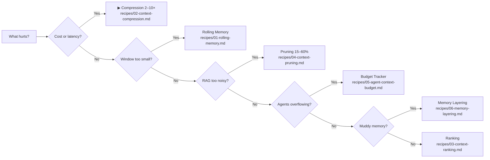

# Swaha — Save 40% on LLM Costs Without Sacrificing Quality

**Swaha** gives you copy-paste Python code for managing what you send to LLMs. Less tokens = lower costs, faster responses, better quality.

## The Swaha Model

Every context problem reduces to three axes:

| Axis | Question | Solution |
|------|----------|----------|
| 🪙 **Budget** | Too many tokens for my window? | Compress, prune, rank |
| 🎯 **Relevance** | Wrong or noisy information? | Rank, filter, deduplicate |
| 🧠 **Structure** | No separation between short and long-term memory? | Layer working, episodic, semantic, procedural |

Most teams fix **Budget** first (quickest ROI). Then **Relevance**. Then **Structure**.

## 🧭 Decision Tree



## 👨‍🍳 Recipes by Stack

| For teams using... | Start here | Impact |
|---|---|---|
| LangChain / LlamaIndex (RAG) | [Pruning](./context-patterns/recipes/04-context-pruning.md) | −15–60% tokens |
| Claude / GPT-4 (long chat) | [Rolling Memory](./context-patterns/recipes/01-rolling-memory.md) | Never lose context |
| CrewAI / AutoGen (multi-agent) | [Budget Tracker](./context-patterns/recipes/05-agent-context-budget.md) | Auto-archive |
| Any LLM app (cost-cutting) | [Compression](./context-patterns/recipes/02-context-compression.md) | 2–10× reduction |
| Building agents from scratch | [Memory Layering](./context-patterns/recipes/06-memory-layering.md) | 4 tiers |
| Retrieval scoring | [Ranking](./context-patterns/recipes/03-context-ranking.md) | Filter noise |

> 🚀 **Start with Compression** — most teams get the biggest win first. Reduces tokens 2–10× with three lines of Python.

## Benchmarks

| Pattern | Token reduction | Quality impact | Cost saving |
|---------|---------------|---------------|------------|
| Structural compression | 1.5–2× | None (lossless) | ~40% |
| Extractive compression | 2–5× | Minimal | ~60% |
| Context pruning (RAG) | 15–60% | Improves (less noise) | ~30% |
| Rolling memory + summaries | 3–10× | Slight (summary drift) | ~70% |

*Measured on GPT-4o‑class models with English technical text. Your mileage varies by domain.*

## 📦 What's Inside

| Layer | What You Get |
|---|---|
| [6 Recipes](./context-patterns/recipes/) | Standalone Python, zero deps, copy → paste → run |
| [Decision Guide](./context-patterns/DECISION-GUIDE.md) | Mermaid tree + comparison tables + anti-patterns |
| [Cheatsheets](./context-patterns/cheatsheets/) | One-page quick references |
| [10‑min Quickstart](./context-patterns/quickstart/) | Walkthrough: prune → rank → compress → assemble |
| [Reference Catalog](./context-patterns/) | 28 sections, 8 deep-dive patterns, 7 architecture examples |

## Quick Start

```bash
git clone https://github.com/your-org/swaha
cd swaha/context-patterns
# Pick a recipe, copy the code, run it
python3 -c "$(cat recipes/02-context-compression.md | sed -n '/```python/,/```/p' | sed '1d;$d')"
```
