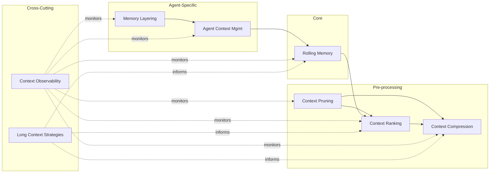

# Decision Guide: Which Context Engineering Pattern Should I Use?

> A decision tree and reference tables to help you choose the right pattern for your problem.

---

## Decision Tree

```mermaid
flowchart TB
    START([You have a context problem]) --> Q1{What's your primary constraint?}

    Q1 -->|"Context window too small<br/>for my data"| Q2
    Q1 -->|"Too many tokens —<br/>cost or latency too high"| COMPRESS
    Q1 -->|"Model ignores or forgets<br/>important information"| Q3
    Q1 -->|"Agent accumulates too<br/>much history over steps"| AGENT
    Q1 -->|"RAG retrieves noisy<br/>or overlapping chunks"| PRUNE
    Q1 -->|"Need structured memory<br/>with different retention tiers"| LAYER

    Q2{Is the content mostly<br/>recent conversation?} -->|Yes| ROLLING
    Q2 -->|"No, it's long documents<br/>or knowledge"| Q4

    Q4{Do you have a specific<br/>query to rank against?} -->|Yes| RANK
    Q4 -->|No| COMPRESS

    Q3{Is the context window<br/>already very large &#40;128K%2B&#41;?} -->|Yes| LONG
    Q3 -->|No| RANK

    LONG -->|"Also need observability"| OBSERVE
    ROLLING -->|"Also want cheap pre-filter"| PRUNE
    COMPRESS -->|"Also want ranking"| RANK
    AGENT -->|"Need to see why"| OBSERVE

    ROLLING([Rolling Memory<br/>./patterns/rolling-memory.md])
    COMPRESS([Context Compression<br/>./patterns/context-compression.md])
    RANK([Context Ranking<br/>./patterns/context-ranking.md])
    PRUNE([Context Pruning<br/>./patterns/context-pruning.md])
    AGENT([Agent Context Mgmt<br/>./patterns/agent-context-management.md])
    LAYER([Memory Layering<br/>./patterns/memory-layering.md])
    LONG([Long Context Strategies<br/>./patterns/long-context-strategies.md])
    OBSERVE([Context Observability<br/>./patterns/context-observability.md])
```



---

## Quick-Reference Table

| Pattern | Primary Use Case | When NOT to Use | Complexity | Token Impact |
|---|---|---|---|---|
| [Rolling Memory](./patterns/rolling-memory.md) | Conversational agents, chat, multi-turn tasks | Single-turn QA, retrieval-only RAG | Low | Keeps context bounded |
| [Context Compression](./patterns/context-compression.md) | Large documents, verbose logs, cost reduction | Already-concise input, real-time with <50ms budget | Medium | 2–40× reduction |
| [Context Ranking](./patterns/context-ranking.md) | RAG pipelines, multi-source assembly | Single-source, or all sources equally relevant | Medium | Filters 20–60% items |
| [Context Pruning](./patterns/context-pruning.md) | Noisy RAG, overlapping chunks, chat filler | Clean, curated input, or <1K tokens | Low | 15–60% reduction |
| [Agent Context Mgmt](./patterns/agent-context-management.md) | Autonomous agents with tool calls | Single-step tools, stateless functions | High | Bounded by design |
| [Memory Layering](./patterns/memory-layering.md) | Long-running agents, personal assistants | Short sessions, stateless processing | High | Spreads across tiers |
| [Long Context Strategies](./patterns/long-context-strategies.md) | 128K+ models, whole-document processing | Cost-sensitive, latency-critical apps | Medium | Uses full window efficiently |
| [Context Observability](./patterns/context-observability.md) | Debugging, production monitoring, tuning | Prototype/stage without production load | Medium | Monitoring overhead only |

---

## Decision Matrix by Use Case

| Your Situation | Start Here | Then Consider | Skip If |
|---|---|---|---|
| Building a **chatbot** with long sessions | [Rolling Memory](./patterns/rolling-memory.md) | + [Context Pruning](./patterns/context-pruning.md) for filler | Sessions < 10 turns |
| Building a **RAG system** | [Context Ranking](./patterns/context-ranking.md) | + [Context Pruning](./patterns/context-pruning.md) then [Context Compression](./patterns/context-compression.md) | Single source |
| Building an **autonomous agent** | [Agent Context Mgmt](./patterns/agent-context-management.md) | + [Rolling Memory](./patterns/rolling-memory.md) for chat, + [Context Observability](./patterns/context-observability.md) | Single-step tasks |
| **Reducing costs** at scale | [Context Compression](./patterns/context-compression.md) | + [Context Pruning](./patterns/context-pruning.md) for pre-filter | Already at minimum tokens |
| **Debugging** poor answers | [Context Observability](./patterns/context-observability.md) | Snapshot + replay pipeline stages | Random failures without pattern |
| **Long document** analysis (128K+ models) | [Long Context Strategies](./patterns/long-context-strategies.md) | + [Context Ranking](./patterns/context-ranking.md) for position optimization | Budget fixed |
| **Personal assistant** with persistent knowledge | [Memory Layering](./patterns/memory-layering.md) | + [Rolling Memory](./patterns/rolling-memory.md) for working memory | Ephemeral sessions |

---

## Depth Score: How Much Pattern Do You Need?

```
                           Pattern Depth ↗
                               ▲
                               │
   Memory Layering ───────────┤
   Agent Context Mgmt ────────┤
   Long Context Strategies ───┤
   Context Observability ─────┤
   Context Compression ───────┤
   Context Ranking ───────────┤
   Context Pruning ───────────┤
   Rolling Memory ────────────┤
                               └──────────────────────────► Simplicity ↗
```

- **Start simple:** Rolling Memory + Pruning covers 70% of common problems.
- **Add depth iteratively:** Add Ranking when retrieval gets noisy, Compression when costs bite, Observability when debugging takes too long.
- **Only go full stack:** Memory Layering + Agent Context Mgmt when building persistent agents that run for hours or days.

---

## Pattern Relationships



**Pipeline ordering recommendation:**

```text
Raw Input → Pruning → Ranking → Compression → Prompt Assembly → LLM
                                                           ↑
                                             Rolling Memory (chat history)
```

---

## Anti-Patterns to Avoid

| Anti-Pattern | Why It Fails | Better Approach |
|---|---|---|
| **Pruning after ranking** | Ranking wastes compute on items that pruning would have removed | Prune first, rank survivors |
| **Compression before pruning** | Compressor wastes capacity on redundant content | Prune first, compress survivors |
| **Ranking without pruning** | Noisy items compete with quality ones for top slots | Prune noise floor before ranking |
| **Rolling Memory without summaries** | Hard cutoff loses all older context | Always add a summary layer between active window and archive |
| **Agent Context without budget tracking** | Context silently grows until crash or OOM error | Track token budget at every step, trigger archival before overflow |
| **Memory Layering without consolidation** | Episodic and semantic stores stay disconnected | Run periodic consolidation (episodic → semantic) |

---

## When to Combine Patterns

| Combination | Why | Example Stack |
|---|---|---|
| Pruning → Ranking → Compression | Full RAG pipeline | RAG system with chat history, docs, web results |
| Rolling Memory → Pruning → Ranking | Chat with history + RAG | Customer support agent with knowledge base |
| Agent Context Mgmt → Rolling Memory → Observability | Production agent | Coding agent with file operations |
| Pruning → Compression | Fast pre-filter for cost reduction | Log analysis pipeline |
| Long Context Strategies + Ranking | Optimize placement in large windows | Book/document analysis with 200K window |

---

## Quick Diagnostics

**If your model is giving poor answers:**

1. Is the right information in the prompt at all?
   - No → Fix retrieval. → Add [Context Observability](./patterns/context-observability.md) to see what's missing.
   - Yes → Go to 2.

2. Is the right information buried in the middle?
   - Yes → Add [Context Ranking](./patterns/context-ranking.md) to surface it.
   - No → Go to 3.

3. Is the prompt too long, wasting budget on noise?
   - Yes → Add [Context Pruning](./patterns/context-pruning.md) then [Context Compression](./patterns/context-compression.md).
   - No → Go to 4.

4. Is the agent forgetting what it did 5 steps ago?
   - Yes → Add [Rolling Memory](./patterns/rolling-memory.md) or [Agent Context Mgmt](./patterns/agent-context-management.md).
   - No → Check model capability, prompt quality, or task complexity.
