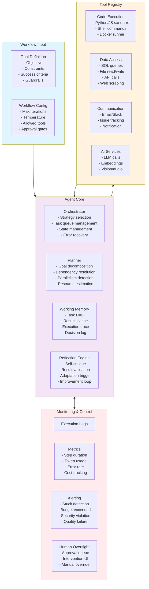

# Autonomous Workflow Agent Architecture

An AI agent that autonomously plans, executes, and monitors multi-step workflows with dynamic adaptation.

## System Architecture

## Agent Loop Components

| Component | Function | Error Handling |
|-----------|----------|----------------|
| **Planner** | Decompose goal → task DAG | Re-plan on failure with alternative strategy |
| **Orchestrator** | Schedule & execute tasks | Retry with backoff, skip optional tasks |
| **Reflection Engine** | Self-critique outputs | Escalate to human after N failed critiques |
| **Working Memory** | Maintain execution context | Snapshot state for recovery |

## Execution Strategies

| Strategy | Use Case | Parallelism | Adaptation |
|----------|----------|-------------|------------|
| **Linear** | Sequential dependencies | None | Re-route on failure |
| **Parallel Fan-out** | Independent sub-tasks | Full | Merge results |
| **Iterative Refinement** | Quality-critical output | None | Loop until quality threshold |
| **Map-Reduce** | Large-scale data processing | Batch | Re-partition on skew |
| **Dynamic Discovery** | Unknown path | Limited | Explore and expand |

## Extensibility

- **Custom executors**: Add new runtime environments (container, serverless, edge)
- **Tool policies**: Granular allow/deny rules per tool, per role
- **Strategy plugins**: Implement custom workflow strategies
