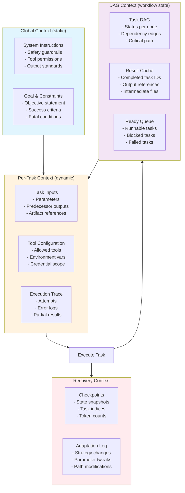
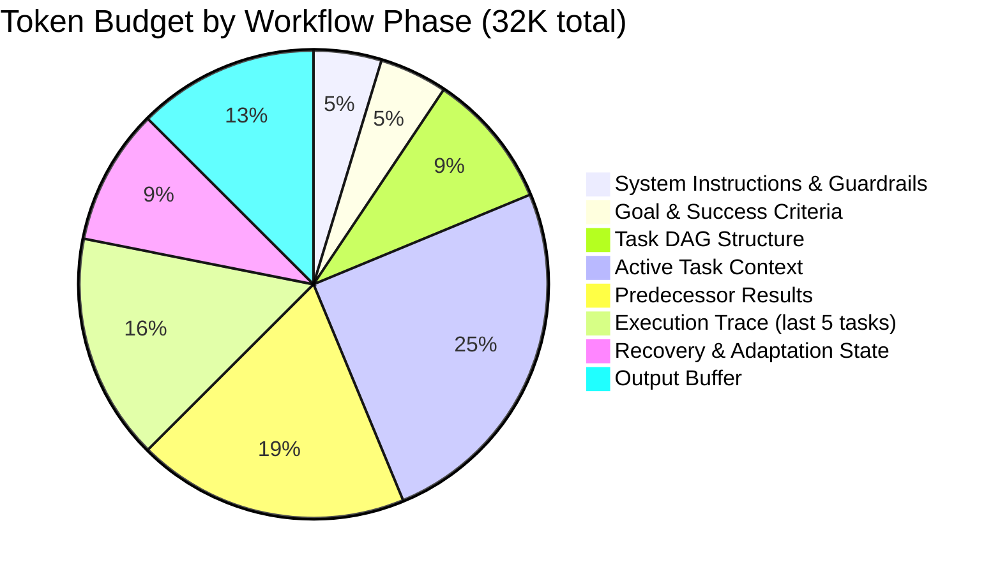

# Autonomous Workflow Agent Context Flow

Managing dynamic execution context across multi-step autonomous workflows with branching and recovery.

## Context Architecture for Workflow Execution



## Context Budget per Phase



## Context Freshness by Artifact Type

| Context Artifact | Scope | Refresh | Eviction |
|-----------------|-------|---------|----------|
| Task DAG status | Global workflow | After each task completion | Archived on workflow completion |
| Result cache | Global workflow | On new result written | Evict oldest by token when budget exceeded |
| Execution trace | Per task | On each retry | Keep last 5 traces per task max |
| Checkpoint | Every N tasks | Periodic (every 3 tasks) | Keep last 3 checkpoints |
| Adaptation log | Global workflow | On strategy change | Keep all (typically small) |

## Adaptation Decision Context

When a task fails, the agent assembles a specialized adaptation context:

```json
{
  "adaptation_id": "adapt_42",
  "failed_task": {
    "id": "T-07",
    "type": "validate_end_to_end",
    "attempt": 2,
    "last_error": "Prometheus target unreachable after deployment"
  },
  "surrounding_context": {
    "predecessors": [{"id": "T-06", "status": "success", "output_summary": "Alert rules applied"}],
    "dependents": [{"id": "T-08", "status": "blocked"}],
    "critical_path_impact": true
  },
  "adaptation_options": [
    {"strategy": "retry_different_params", "expected_impact": "medium"},
    {"strategy": "skip_and_log", "expected_impact": "high", "risk": "incomplete monitoring"},
    {"strategy": "human_escalation", "expected_impact": "delayed"}
  ],
  "decision": {
    "chosen": "retry_different_params",
    "rationale": "Target unreachable - may be transient DNS issue",
    "confidence": 0.7
  }
}
```

## Failure Modes

| Mode | Symptom | Mitigation |
|------|---------|------------|
| **DAG deadlock** | Circular or unresolvable dependencies | Cycle detection before execution; deadlock breaker timeout |
| **Context explosion** | Results too large for context window | Summarize predecessor outputs; reference artifacts by path |
| **Task drift** | Agent diverges from original goal | Pin goal to every task context; periodic goal-check |
| **Recovery loop** | Same failure repeated with different params | Escalate after N distinct strategies tried |
| **Orphan resources** | Created resources not cleaned up on abort | Compensating transaction registry per workflow |
