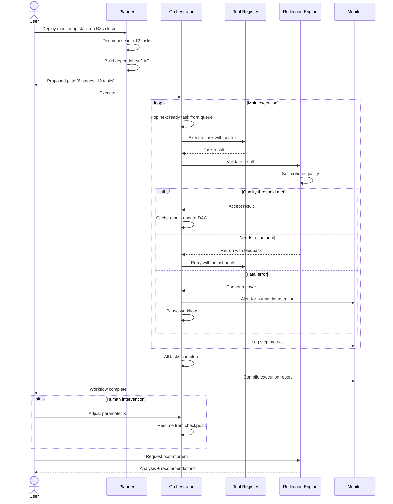
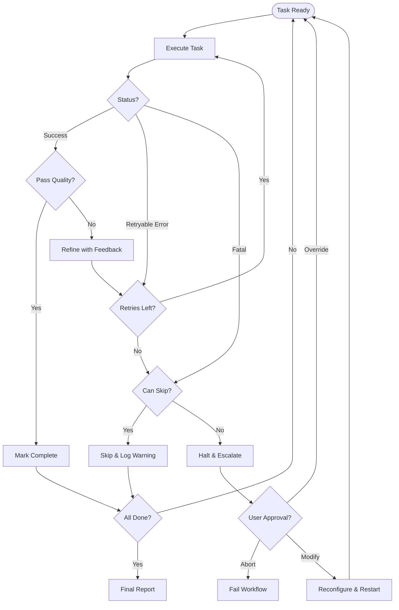
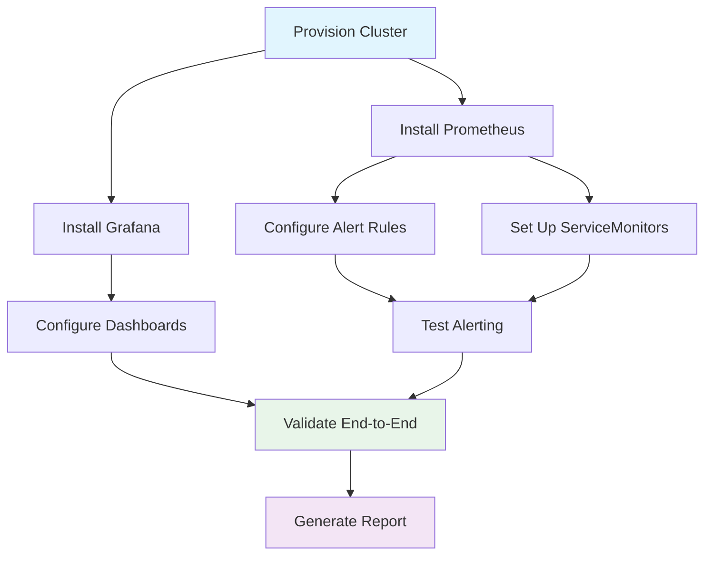

# Autonomous Workflow Agent Workflow

Goal-driven execution from decomposition through verification with dynamic adaptation.

## Core Execution Loop

## Decision Flow: Self-Adaptation

## Task Dependency DAG Example

## Execution Budget Controls

| Control | Limit | Action on Exceed |
|---------|-------|------------------|
| Max iterations | 50 per workflow | Escalate for approval |
| Step timeout | 5 min per task | Retry once, then escalate |
| Token budget | 100K per workflow | Pause, ask to continue |
| Cost cap | $5.00 per workflow | Pause, ask to increase budget |
| Failure threshold | 3 consecutive failures | Escalate to human |
