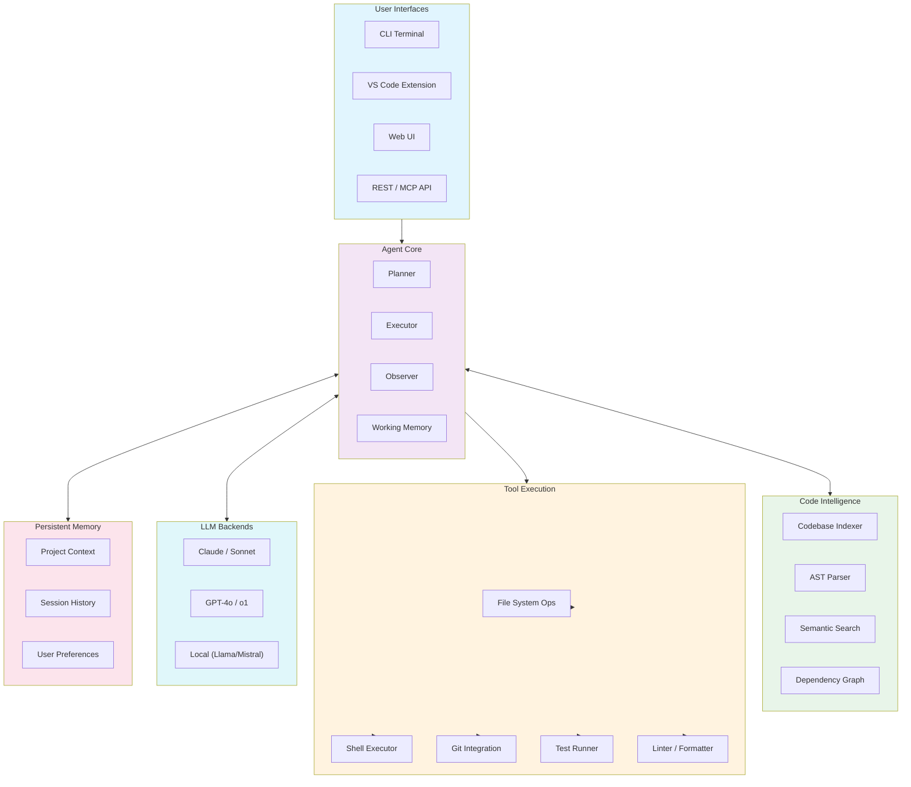

# Coding Agent Architecture

An AI-powered coding assistant that understands codebases, generates changes, runs tests, and manages git workflows.

## System Architecture

## Agent Loop Phases

| Phase | Description | Tools Used |
|-------|-------------|------------|
| **Understand** | Map user request to codebase context | Indexer, Semantic Search |
| **Plan** | Decompose task into ordered steps | LLM, Planner |
| **Implement** | Execute file reads/writes/edits | File System, AST Parser |
| **Verify** | Run tests, linter, type check | Test Runner, Linter |
| **Review** | Self-review diff for correctness | LLM, Diff Analyzer |
| **Commit** | Stage, commit, push / PR | Git Integration |

## Extensibility

- **Custom tools**: Any CLI tool can be wrapped as an agent capability via a tool manifest
- **Language support**: AST parsers are language-agnostic via tree-sitter grammars
- **LLM backends**: Plugable model adapters for cloud, local, and hybrid inference
