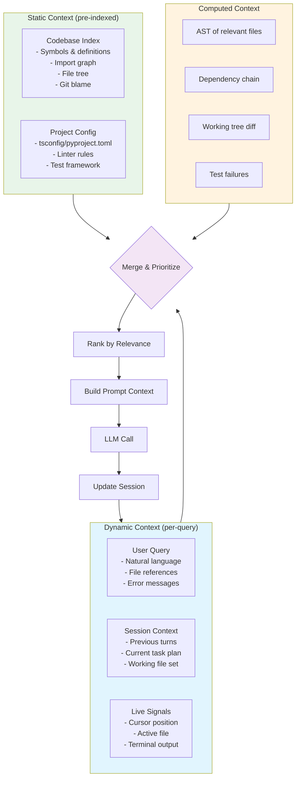
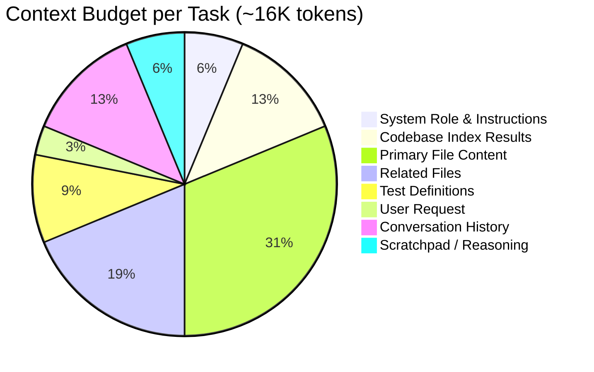

# Coding Agent Context Flow

How the coding agent gathers, prioritizes, and manages context across the codebase.

## Context Sources



## Token Budget Allocation



## Context Freshness and Caching

| Context Item | Source | Cache TTL | Refresh Trigger |
|---|---|---|---|
| File AST | Static index | Until file changes | File write event |
| Symbol definitions | Static index | Session-long | Re-index on demand |
| Import graph | Static index | Session-long | Dependency change |
| Current file content | Live signal | Immediate | Cursor/scroll event |
| Test output | Dynamic | Per run | Test execution |
| User preferences | Session | Session-long | User changes |

## Prioritization Rules

1. **Working set first**: Files the user is actively viewing/editing get highest priority
2. **Import locality**: Files near the current focus in the import graph rank above distant files
3. **Error context**: Stack trace lines and error symbols are injected at medium priority
4. **Recency**: Files touched earlier in the session get summarized, not full content
5. **Test relevance**: Test files for the module under modification are always included

## Failure Modes

| Mode | Symptom | Mitigation |
|------|---------|------------|
| **Context staleness** | Agent references old code | Timestamp every indexed symbol; warn on staleness |
| **Token overflow** | Truncated context loses critical imports | Hierarchical: full content for active file, signatures for rest |
| **Incorrect imports** | Generated code references wrong paths | Validate all import paths against index before suggesting |
| **Repeated context** | Same symbol in multiple chunks | Deduplicate by symbol qualified name |

## Example Context Snapshot

```json
{
  "task_id": "t_42",
  "focus_files": ["src/routes/users.tsx", "src/components/UserList.tsx"],
  "index_results": {
    "symbols": 23,
    "files_referenced": 7,
    "depth": "module-level"
  },
  "context_stack": [
    {"type": "active_file", "path": "src/routes/users.tsx", "tokens": 4200},
    {"type": "related", "path": "src/services/userService.ts", "tokens": 1800},
    {"type": "import_chain", "symbols": ["User", "UserList", "PaginatedResponse"], "tokens": 400},
    {"type": "test", "path": "src/routes/__tests__/users.test.tsx", "tokens": 1500},
    {"type": "recent_output", "lines": "Error: property 'page' does not exist on type 'UserListProps'", "tokens": 100}
  ],
  "total_tokens": 8000,
  "budget_remaining": 8000
}
```
