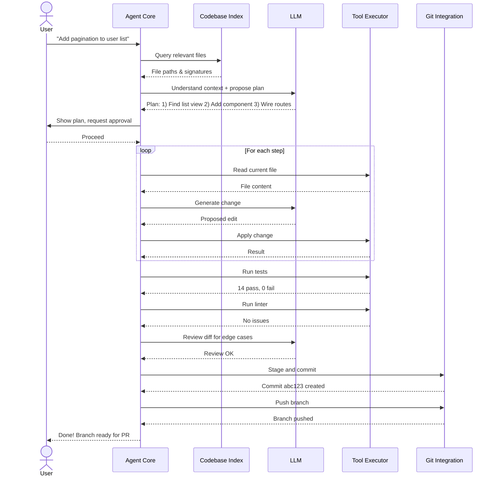
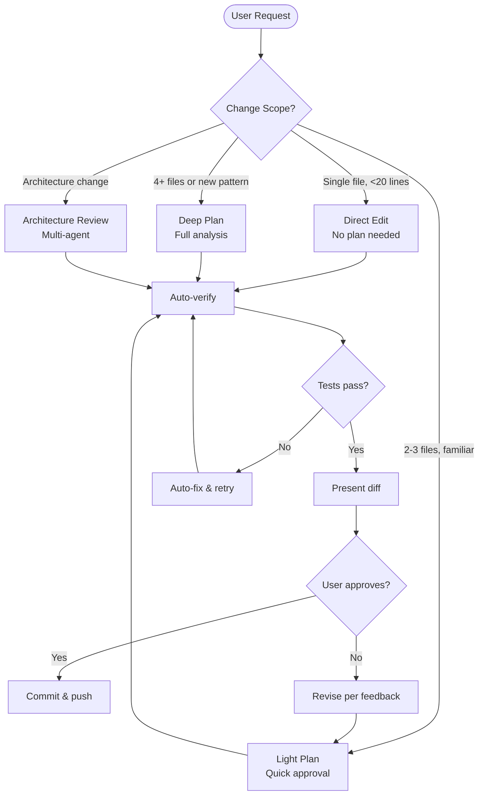
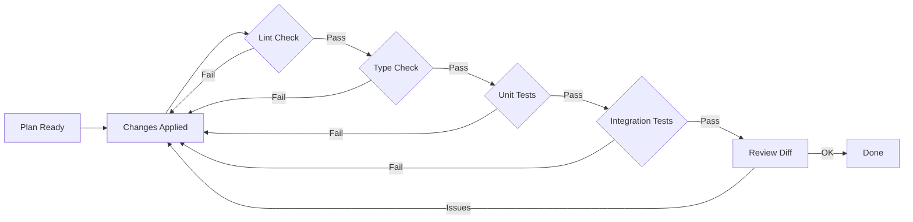

# Coding Agent Workflow

Step-by-step flow from user request to code change, with verification gates.

## Full Task Lifecycle

## Decision Flow: When to Delegate vs. Direct Edit

## Verification Gates

## Context Budget per Phase

| Phase | Token Budget | Context Sources |
|-------|-------------|-----------------|
| Understand | 8K | User query, file signatures, symbol index |
| Plan | 4K | Analysis results, dependency hints |
| Implement | 12K | Full target file, relevant imports |
| Verify | 2K | Test output, lint results |
| Review | 8K | Full diff, related files |
