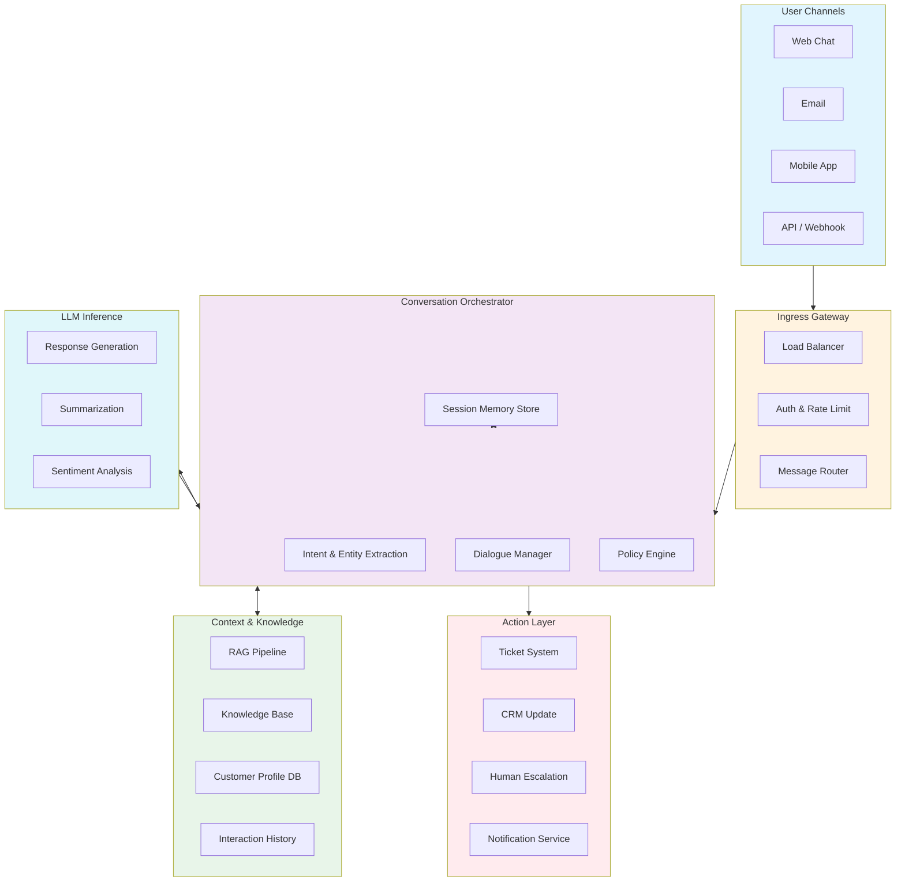

# Customer Support Agent Architecture

A context-rich multi-channel customer support system that uses LLMs with RAG, session memory, and escalation orchestration.

## System Architecture

## Component Responsibilities

| Component | Responsibility |
|-----------|----------------|
| **Ingress Gateway** | Authentication, rate limiting, message normalization across channels |
| **NLU Engine** | Intent classification, entity extraction, language detection |
| **Dialogue Manager** | Turn tracking, response policy, escalation triggers |
| **Session Memory** | Sliding-window conversation history with summarization |
| **RAG Pipeline** | Retrieval-augmented generation from knowledge base |
| **Policy Engine** | Business rules for routing, escalation, and fallback |

## Design Decisions

- **Stateless gateway + stateful orchestrator**: Gateway scales horizontally; orchestrator maintains session affinity via session ID
- **Separate memory store**: Enables hot-swapping memory strategies (sliding window → summarization → hybrid) without touching other components
- **RAG as plugin**: Knowledge base is swappable (FAISS, Pinecone, pgvector) via adapter interface
- **Async escalation**: Human handoff uses a message queue — agent never blocks on ticket creation

## Extensibility

- Add new channel via Gateway adapter
- Add new LLM provider via model abstraction layer
- Add new knowledge source via RAG connector interface
- Custom escalation policies via Policy Engine rules DSL
