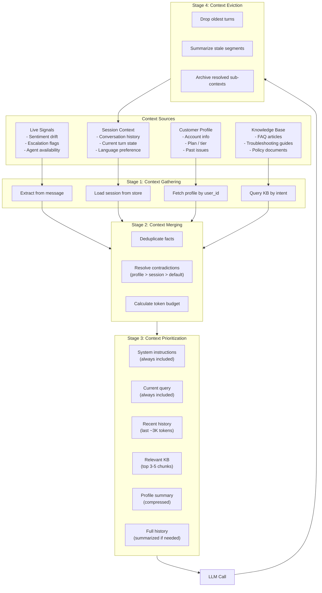
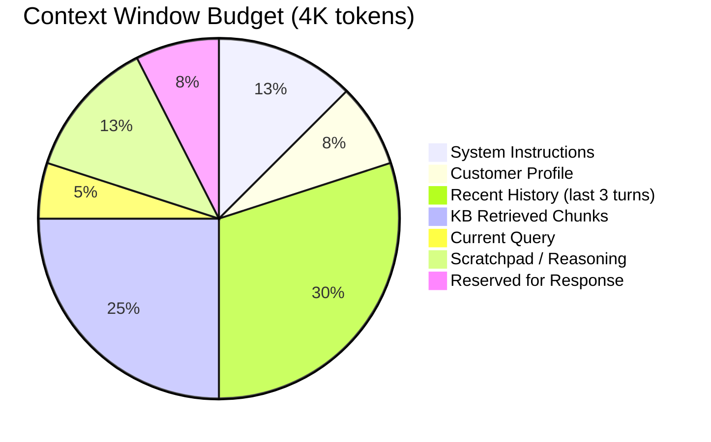

# Customer Support Agent Context Flow

How context is gathered, merged, prioritized, and evicted throughout a support conversation.

## Context Sources and Lifetimes



## Context Budget Allocation (token distribution per turn)



## Context Freshness Rules

| Context Item | TTL | Refresh Trigger | Eviction Policy |
|---|---|---|---|
| Session history | Per turn | Each new message | Drop oldest at token budget |
| Customer profile | Session-long | Explicit profile update | Carried whole session |
| KB chunks | Per intent | Intent change | Replaced entirely |
| Sentiment score | Per turn | Each response | Overwritten each turn |
| Escalation status | Until resolved | Escalation event | Archived on resolution |

## Failure Modes

| Mode | Symptom | Mitigation |
|------|---------|------------|
| **Context overflow** | Token budget exceeded, truncated response | Implement hierarchical summarization of older turns |
| **Stale profile** | Wrong account context | Check profile timestamp; re-fetch if > 5 min old |
| **KB hallucination** | Retrieved but irrelevant chunks | Add relevance threshold + fallback to clarification |
| **Context bleed** | Data from unrelated conversations | Strict session ID isolation in memory store |

## Example: Context Composition for Escalation

```json
{
  "session_id": "sess_abc123",
  "priority": "high",
  "context_stack": [
    {"source": "system", "tokens": 450},
    {"source": "profile", "summary": "Premium user, 3 previous escalations", "tokens": 200},
    {"source": "history", "turns": 5, "tokens": 1400, "summary": "User unable to cancel subscription via UI"},
    {"source": "kb", "chunks": 2, "tokens": 600, "relevance_scores": [0.92, 0.87]},
    {"source": "live_query", "text": "I want to speak to a supervisor now", "tokens": 30}
  ],
  "total_tokens": 2680,
  "budget_remaining": 1320
}
```
