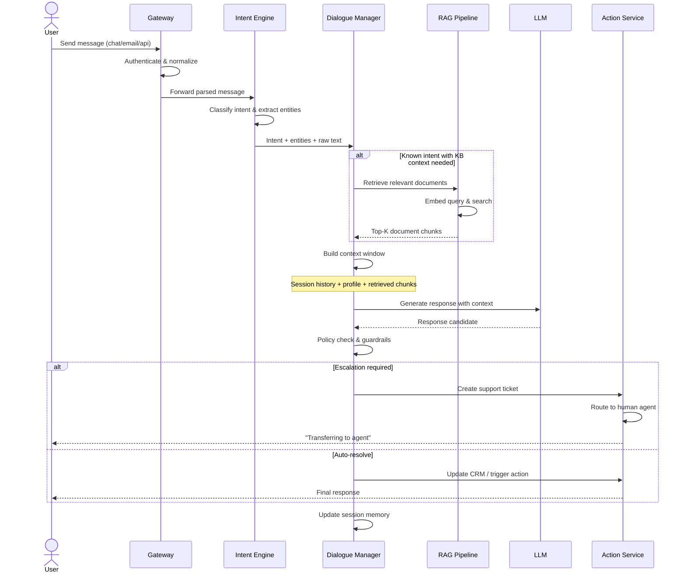
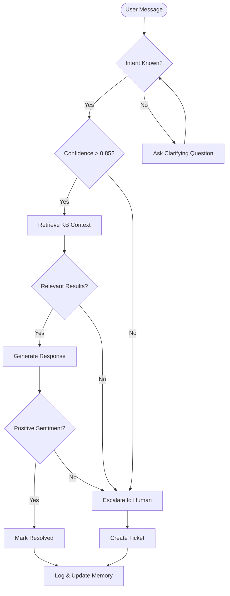
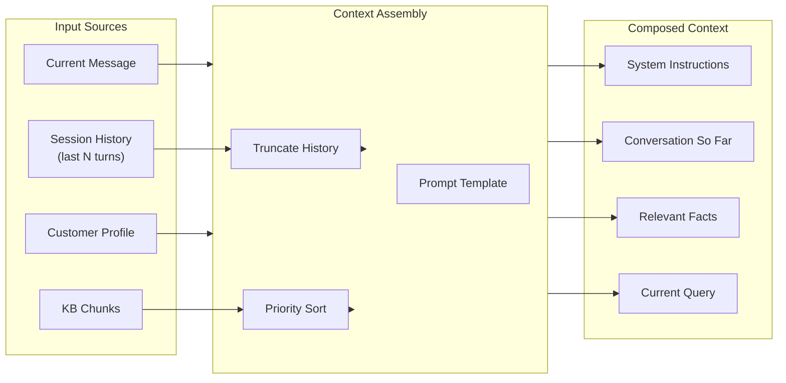

# Customer Support Agent Workflow

End-to-end flow from user message to resolution, with decision branches for automation vs. escalation.

## Core Message Processing Flow

## Decision Flow: Auto-resolve vs. Escalate

## Context Window Assembly

## Resource Allocation by Scenario

| Scenario | History Depth | KB Chunks | Profile Included | LLM Call Type |
|----------|--------------|-----------|-----------------|---------------|
| Simple FAQ | 0-2 turns | 3 chunks | No | Direct generation |
| Troubleshooting | 3-5 turns | 5 chunks | Yes (plan) | Structured response |
| Complaint | Full session | 3 chunks | Yes (full) | Sentiment + generation |
| Account change | 1 turn | 0 chunks | Yes (full) | Tool call |
| Multi-intent | 2 turns | 5 chunks | Yes | Decompose + generate |
