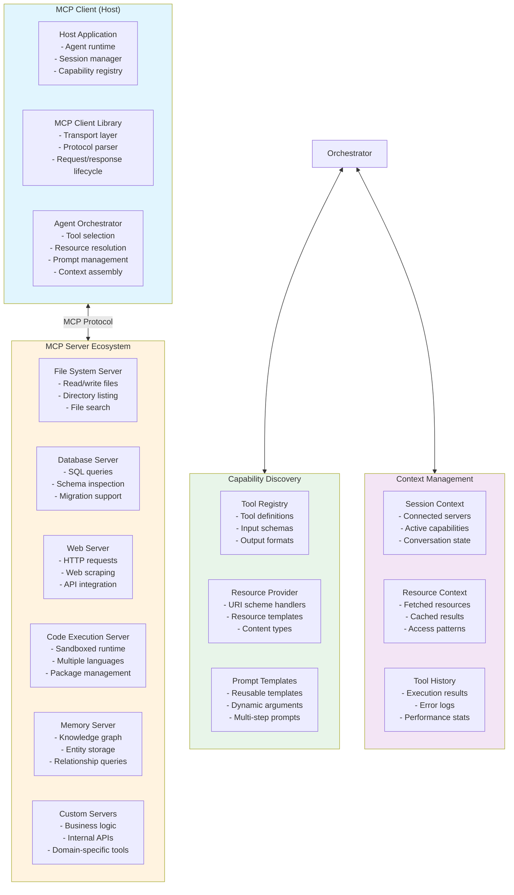
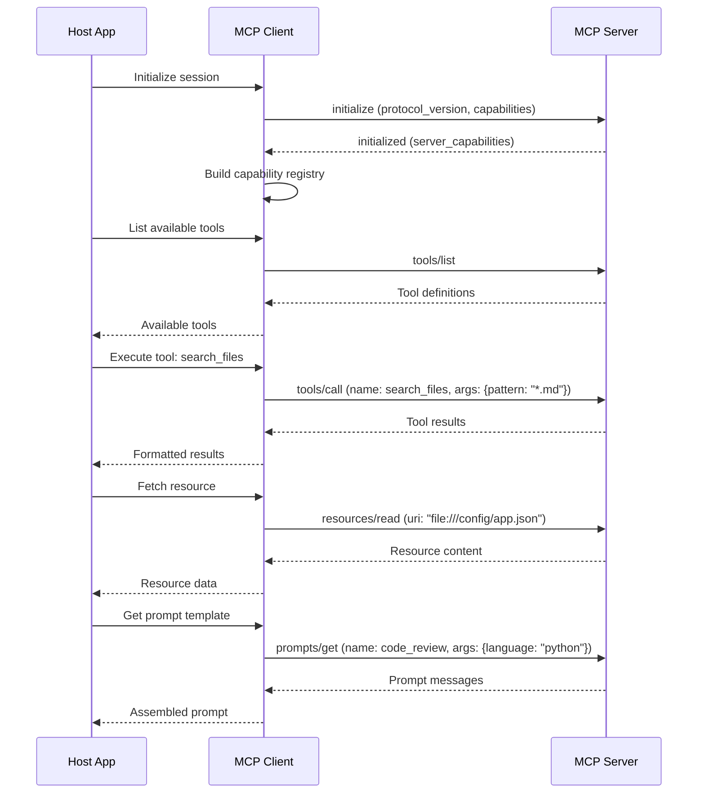

# MCP-Powered Agent Architecture

An AI agent built on the Model Context Protocol (MCP), leveraging a federated ecosystem of servers for tools, resources, and prompts.

## System Architecture

## MCP Protocol Flow

## Server Architecture

| Server | Tools Provided | Resources Exposed | Transport |
|--------|---------------|-------------------|-----------|
| **File System** | read, write, search, list | file:// URIs | stdio |
| **Database** | query, execute, inspect | postgresql://, mysql:// URIs | TCP |
| **Web** | fetch, scrape, api_call | http://, https:// URIs | stdio |
| **Code Execution** | run_python, run_js, install_package | sandbox:// URIs | stdio |
| **Memory** | store, recall, search_entities | memory:// URIs | TCP |

## Extensibility

- **Custom servers**: Implement any tool/resource/prompt combination via the MCP spec
- **Composite servers**: Aggregate multiple backends behind a single MCP interface
- **Middleware servers**: Transform/intercept requests between client and server
