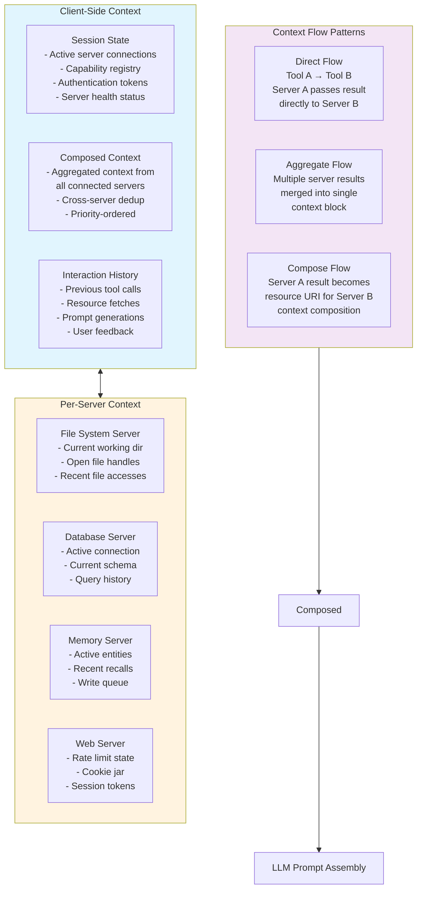
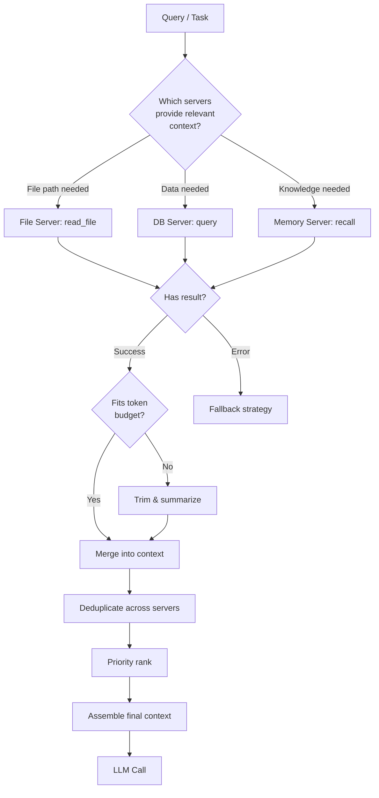
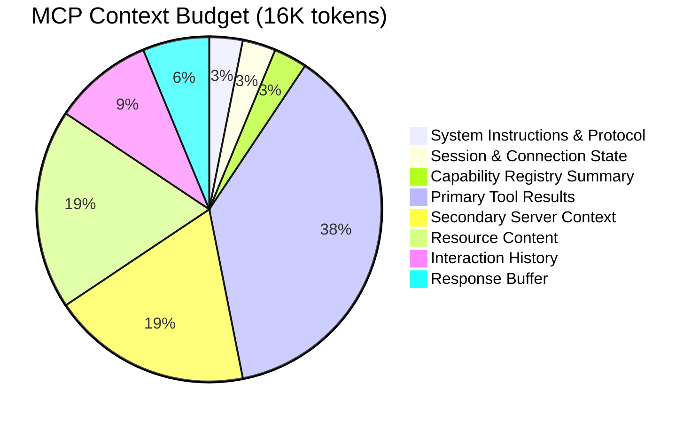

# MCP-Powered Agent Context Flow

How context is managed across multiple MCP servers, capabilities, and session state.

## Multi-Server Context Architecture



## Context Aggregation Strategy



## Token Budget per Context Source



## Server Context Lifecycle

| Server | Connection Init | Context Lifetime | Reconnect Strategy |
|--------|----------------|-----------------|-------------------|
| **File System** | On session start | Session-scoped | Auto-reconnect with backoff |
| **Database** | On first query | Connection pool (max 30 min) | Refresh on each query |
| **Memory** | On session start | Persistent with session ID | Cache locally, sync on reconnect |
| **Web** | On first fetch | Stateless (per request) | New connection each request |

## Context Flow Patterns in Detail

### Direct Flow
Server A output → Server B input → combined result

```json
{
  "pattern": "direct",
  "flow": [
    {"server": "file_system", "tool": "read_file", "result": "SELECT * FROM users;"},
    {"server": "database", "tool": "query",
     "input": {"sql": "FROM_PREVIOUS_STEP"},
     "result": [{"id": 1, "name": "Alice"}, {"id": 2, "name": "Bob"}]}
  ]
}
```

### Aggregate Flow
Multiple servers queried independently → results merged

```json
{
  "pattern": "aggregate",
  "sources": [
    {"server": "memory", "resource": "memory://project/context", "tokens": 1200},
    {"server": "file_system", "resource": "file://README.md", "tokens": 800},
    {"server": "web", "resource": "https://api.example.com/status", "tokens": 200}
  ],
  "merged_tokens": 2200
}
```

## Failure Modes

| Mode | Symptom | Mitigation |
|------|---------|------------|
| **Server disconnect** | Tool call timeout | Retry with backoff; if unavailable, use fallback |
| **Capability mismatch** | Server doesn't support requested tool | Re-query capability list; cache and version-check |
| **Context fragmentation** | Results scattered across servers without linkage | Maintain cross-reference map of server outputs |
| **Protocol version skew** | Initialize fails on version mismatch | Support multiple protocol versions; negotiate downgrade |
| **Resource leak** | Server connections not closed | Connection pool with TTL + health check pings |

## Example Aggregated Context

```json
{
  "session_id": "mcp_sess_789",
  "servers_connected": ["file_system", "database", "memory"],
  "capabilities": {
    "tools": ["read_file", "write_file", "search_files", "sql_query", "sql_execute", "store", "recall"],
    "resources": ["file://", "database://", "memory://"],
    "prompts": ["code_review", "sql_audit", "deploy_check"]
  },
  "context_stack": [
    {"source": "file_system", "type": "tool_result", "content": "PR #142 diff (450 lines)", "tokens": 3200},
    {"source": "database", "type": "tool_result", "content": "Schema migration check: 3 pending migrations", "tokens": 600},
    {"source": "memory", "type": "resource", "content": "Project conventions: SQL style guide", "tokens": 1500},
    {"source": "session", "type": "interaction", "content": "Previous review: approved migration #141", "tokens": 400}
  ],
  "total_tokens": 5700,
  "budget_remaining": 10300
}
```
