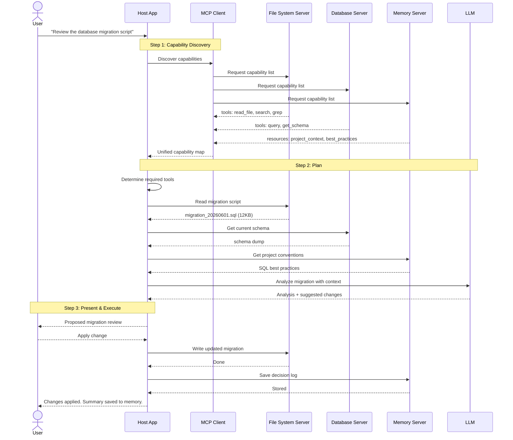
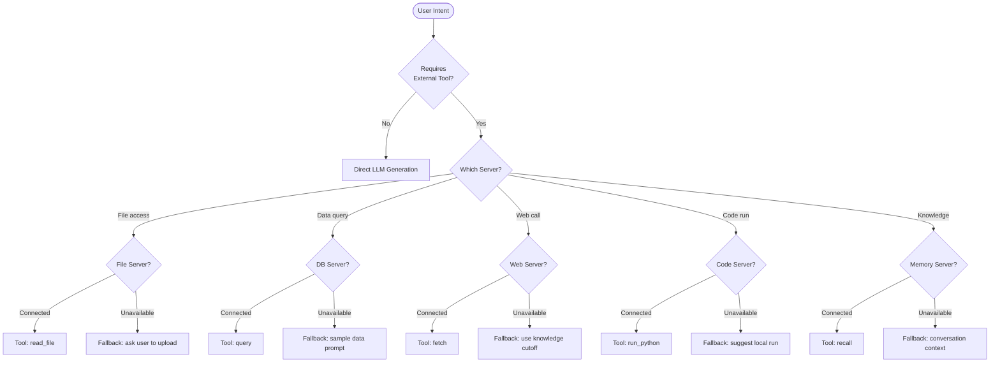

# MCP-Powered Agent Workflow

End-to-end interaction between an MCP host, its servers, and the user, spanning capability discovery through execution.

## Full Interaction Flow



## Tool Selection Decision



## Capability Negotiation Flow

```mermaid
sequenceDiagram
    participant Host as Host
    participant Server as MCP Server

    Host->>Server: initialize
    Note over Server: Server declares supported
                   protocol version
                   capabilities (tools, resources, prompts)
    Server-->>Host: initialized + server info

    Host->>Server: List capabilities

    par Query tools
        Host->>Server: tools/list
        Server-->>Host: [{name, description, inputSchema}]
    and Query resources
        Host->>Server: resources/list
        Server-->>Host: [{uri, name, description, mimeType}]
    and Query prompts
        Host->>Server: prompts/list
        Server-->>Host: [{name, description, arguments}]
    end

    Host->>Host: Build capability map
    Note over Host: For each tool/resource/prompt
                   validate against host requirements
                   register in capability registry

    Host->>Server: Notifications/initialized
    Note over Host,Server: Ready for interaction
```

## Execution Modes

| Mode | Tool Invocation | Error Strategy | Use Case |
|------|----------------|----------------|----------|
| **Eager** | Try all relevant tools in parallel | Roll back on any failure | Exploration & discovery |
| **Sequential** | One tool at a time, passing results | Retry with backoff | Data pipeline steps |
| **Conservative** | Confirm before each tool call | Ask user on error | Destructive operations |
| **Delegated** | Let server decide sub-tools | Server-level error handling | Complex multi-step operations |
