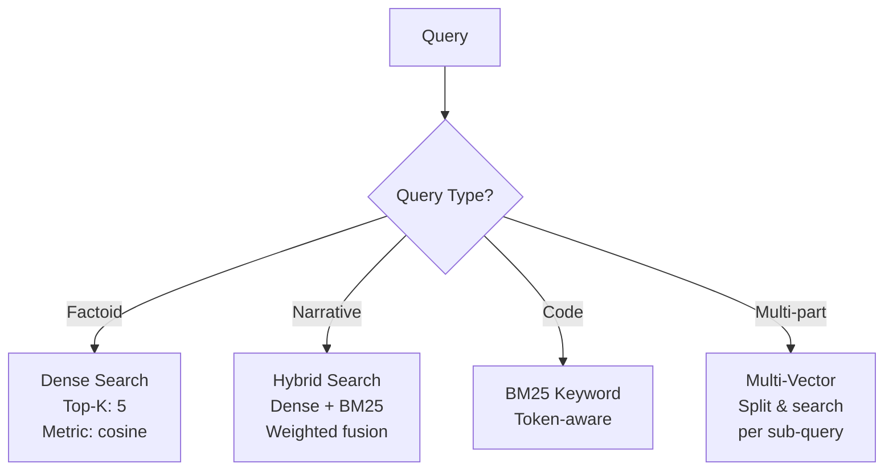

# RAG System Architecture

A complete Retrieval-Augmented Generation system with curated ingestion, multi-strategy retrieval, and context-aware synthesis.

## System Architecture

```mermaid
flowchart TB
    subgraph Ingestion["Ingestion Pipeline"]
        DOCS["Document Sources
- PDF / HTML / MD
- Code repos
- Notion / Confluence
- Slack / Teams
- Databases"]
        LOAD["Document Loader
- Format detection
- Structure preservation
- Metadata extraction"]
        CHUNK["Chunking Strategy
- Recursive split
- Semantic chunking
- Sentence windows
- Overlap config"]
        EMBED["Embedding Service
- text-embedding-3
- Voyage-2
- BGE-M3
- Cohere"]
        INDEX["Vector Index
- FAISS / Pinecone
- pgvector / Qdrant
- Hybrid (dense + sparse)
- Metadata filters"]
    end

    subgraph Retrieval["Retrieval Pipeline"]
        QUERY["Query Processing
- Query rewriting
- Query expansion
- Hypothetical doc gen (HyDE)"]
        SEARCH["Multi-Strategy Search
- Dense vector search
- Sparse keyword (BM25)
- Hybrid fusion
- Multi-vector search"]
        RERANK["Reranking
- Cross-encoder (Cohere/Cohere)
- ColBERT-style ranking
- Context window fitting"]
        FILTER["Post-Filtering
- Metadata filter
- Recency boost
- Authority score
- Diversity sampling"]
    end

    subgraph Generation["Generation Pipeline"]
        FUSION["Fusion Strategy
- Concatenation
- Summary-first
- Map-reduce
- Adaptive context"]
        PROMPT["Prompt Assembly
- System context
- Retrieved chunks
- Source citations
- Guardrails"]
        GEN["LLM Generation
- GPT-4o / Claude
- Command R+
- Mistral Large
- Llama 3"]
        CHECK["Quality Checks
- Faithfulness check
- Answer relevance
- Citation accuracy
- Hallucination detection"]
    end

    Ingestion --> Retrieval
    Retrieval --> Generation

    style Ingestion fill:#e1f5fe
    style Retrieval fill:#fff3e0
    style Generation fill:#e8f5e9
```

## Chunking Strategy Comparison

| Strategy | Granularity | Overlap | Best For |
|----------|-------------|---------|----------|
| **Recursive character** | Fixed tokens | 10-20% | General purpose |
| **Semantic** | Sentence boundaries | 1 sentence | Question-answering |
| **Document-based** | Sections/headings | None | Structured docs |
| **Agent-augmented** | LLM-chunked | Variable | Complex narratives |

## Retrieval Strategy Decision

## Extensibility

- **Chunking plugins**: Implement custom chunking strategies per document type
- **Embedding backends**: Pluggable embedding providers via unified interface
- **Retrieval fusers**: Custom fusion algorithms for multi-strategy retrieval
- **Quality checkers**: Extendable checklist for output validation
