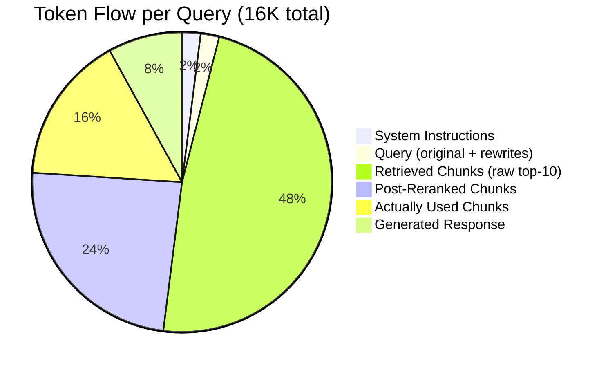

# RAG System Context Flow

How context moves, transforms, and is managed across the RAG pipeline.

## Context Transformation Pipeline

```mermaid
flowchart LR
    subgraph Raw["Raw Context"]
        DOCS["Source Documents
- Full text
- Structure
- Metadata"]
    end

    subgraph Chunked["Chunked Context"]
        CHUNKS["Document Chunks
- Text segments
- Embedding vectors
- Chunk metadata
- Position in doc"]
    end

    subgraph Retrieved["Retrieved Context"]
        RESULTS["Candidate Results
- Raw scores
- Re-ranking scores
- Metadata filters
- Diversity rank"]
    end

    subgraph Selected["Selected Context"]
        SELECTED["Selected Chunks
- Final ordered set
- Sorted by hybrid score
- Fit to token budget"]
    end

    subgraph Augmented["Augmented Context"]
        AUGMENTED["Augmented Prompt
- System instruction
- Retrieved content
- Query with context
- Format instructions"]
    end

    subgraph Generated["Generated Context"]
        RESPONSE["Final Response
- Answer text
- Source citations
- Confidence metrics"]
    end

    DOCS -->|Ingestion Pipeline| CHUNKS
    CHUNKS -->|Retrieval Pipeline| RESULTS
    RESULTS -->|Selection & Ranking| SELECTED
    SELECTED -->|Prompt Assembly| AUGMENTED
    AUGMENTED -->|LLM Generation| RESPONSE

    style Raw fill:#e1f5fe
    style Chunked fill:#fff3e0
    style Retrieved fill:#f3e5f5
    style Selected fill:#e8f5e9
    style Augmented fill:#ffebee
    style Generated fill:#fce4ec
```



## Token Budget per Pipeline Stage



## Context Quality Metrics

| Metric | Definition | Target | Measurement |
|--------|-----------|--------|-------------|
| **Precision@K** | % of retrieved chunks that are relevant | > 80% | Manual judgment or proxy labels |
| **Context utilization** | % of retrieved tokens actually cited | > 40% | Citation tracking |
| **Redundancy** | % of chunks with overlapping content | < 20% | Embedding similarity clustering |
| **Coverage** | % of query aspects covered by chunks | > 90% | Aspect decomposition + match |
| **Novelty** | % of chunks providing new info vs. prior context | > 30% | Comparison to previous queries |

## Chunk Selection Algorithm (simplified)

```python
# Pseudocode for chunk selection under token budget
def select_chunks(candidates, token_budget):
    # 1. Rerank candidates by cross-encoder score
    reranked = cross_encoder_rerank(query, candidates)

    # 2. Filter by relevance threshold
    filtered = [c for c in reranked if c.score > 0.5]

    # 3. Sort by: relevance_score DESC, diversity_bonus DESC
    sorted_chunks = sort_by_score_with_diversity(filtered)

    # 4. Greedy select within budget
    selected = []
    tokens = 0
    for chunk in sorted_chunks:
        if tokens + chunk.tokens <= token_budget:
            selected.append(chunk)
            tokens += chunk.tokens

    # 5. Ensure coverage: add at least one chunk per query aspect
    return ensure_coverage(selected, query_aspects)
```

## Failure Modes

| Mode | Symptom | Mitigation |
|------|---------|------------|
| **Zero retrieval** | No chunks above relevance threshold | Fallback to web search or manual clarification |
| **Context dilution** | Too many chunks, core signal lost | Stricter relevance threshold + diversity filter |
| **Stale embeddings** | Index out of date with source docs | Automatic re-indexing on source changes |
| **Token overflow** | Retrieved chunks exceed budget | Hierarchical summarization before selection |
| **Citation hallucinations** | Generated answer cites wrong chunk | Faithfulness classifier + source-block verification |

## Example Query Context Snapshot

```json
{
  "query": "How do I configure Prometheus for high availability?",
  "query_id": "q_456",
  "retrieval_pipeline": {
    "strategies": ["dense", "bm25"],
    "pre_filter": {"recency": "<12 months"},
    "raw_results": {"dense": 20, "bm25": 20},
    "reranked": 10,
    "selected": 5
  },
  "selected_chunks": [
    {"source": "docs/prometheus/ha.md", "relevance": 0.94, "tokens": 800},
    {"source": "docs/prometheus/federation.md", "relevance": 0.88, "tokens": 650},
    {"source": "blog/prometheus-raft.md", "relevance": 0.82, "tokens": 900},
    {"source": "docs/prometheus/storage.md", "relevance": 0.76, "tokens": 700},
    {"source": "tutorial/prometheus-cluster.md", "relevance": 0.71, "tokens": 950}
  ],
  "total_tokens_used": 4000,
  "budget": 6000,
  "quality_checks": {
    "faithfulness": 0.95,
    "coverage": {"aspects": 3, "covered": 3},
    "redundancy": 0.12
  }
}
```
