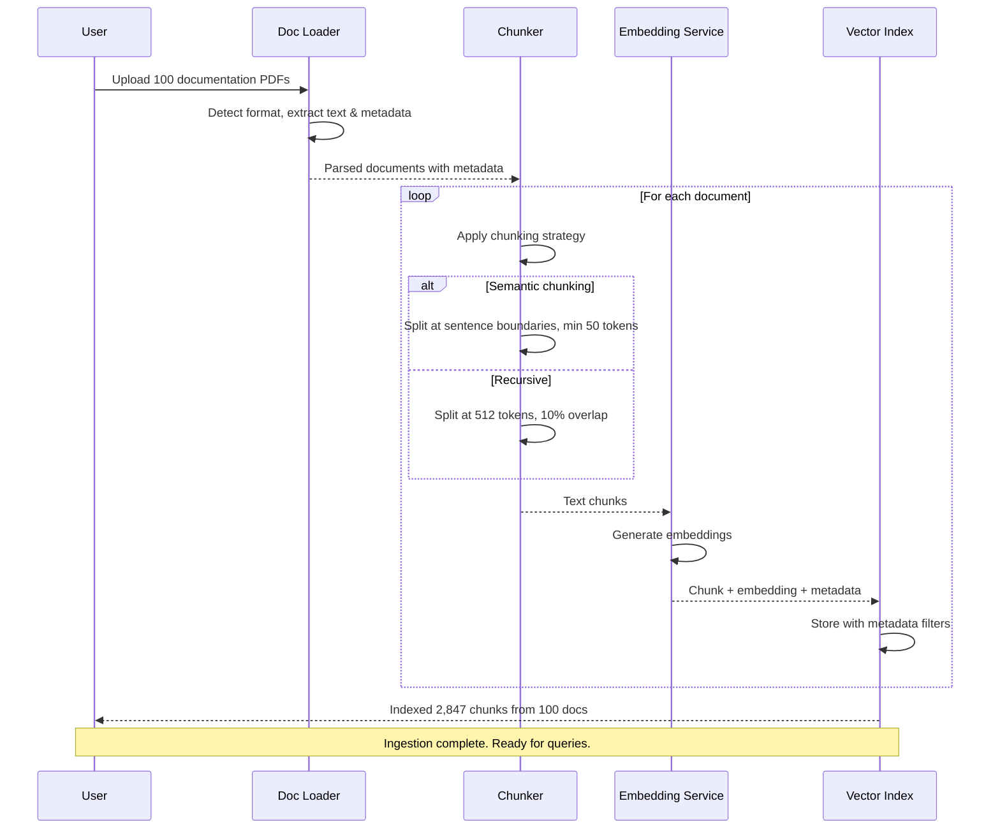
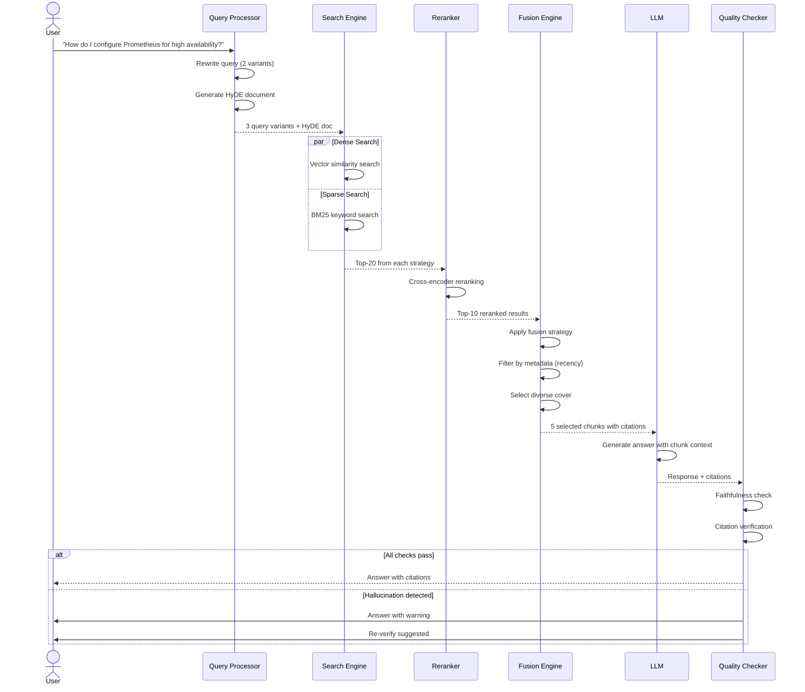
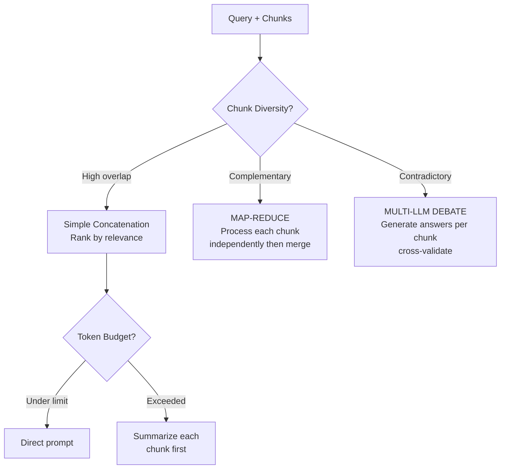

# RAG System Workflow

End-to-end document processing and query-answering pipeline.

## Document Ingestion Flow

## Query Processing Flow

## Fusion Strategy Decision

## Quality Check Gates

| Check | Method | Threshold | Action on Failure |
|-------|--------|-----------|------------------|
| **Faithfulness** | Claim extraction → verify against chunks | < 30% unverified claims | Return with warning |
| **Citation accuracy** | Citation → match chunk source | Exact source match | Remove unverified citations |
| **Answer relevance** | Embedding similarity to query | > 0.7 | Generate more focused answer |
| **Token efficiency** | Response tokens / retrieved tokens | < 50% wastage | Hint to optimize retrieval |
| **Safety check** | Toxicity/safety classifier | < 0.1 | Block response |
