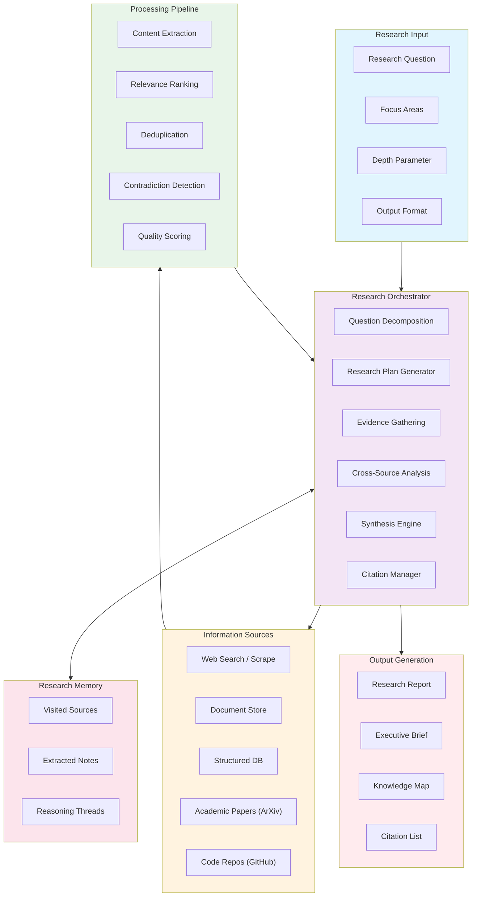

# Research Agent Architecture

An AI research assistant that performs deep investigation across multiple sources, synthesizes findings, and produces structured reports with citations.

## System Architecture

## Research Strategy: Breadth vs. Depth

| Strategy | Use Case | Source Coverage | Iterations | Token Budget |
|----------|----------|----------------|------------|-------------|
| **Quick Scan** | Initial landscape overview | 5-10 sources | 1 round | 8K |
| **Focused Deep Dive** | Specific technical question | 3-5 high-quality sources | 2-3 rounds | 32K |
| **Comprehensive Survey** | Literature review / competing analysis | 20-50 sources | 4-6 rounds | 100K+ |
| **Contradiction Hunt** | Finding disagreements in evidence | 10-20 sources | 3-4 rounds | 16K |

## Extensibility

- **Custom source adapters**: Add new information sources via uniform scraper/API interface
- **Output templates**: Extensible template engine for report formats (markdown, PDF, HTML, slides)
- **Quality rules**: Custom quality scoring criteria for domain-specific relevance
