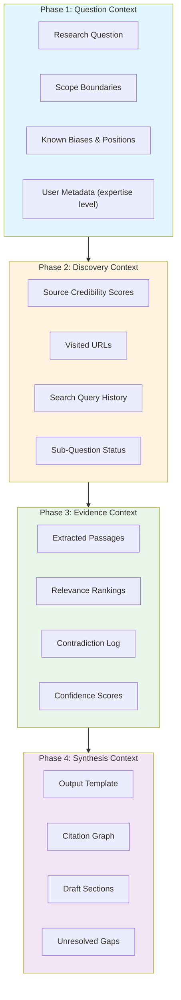
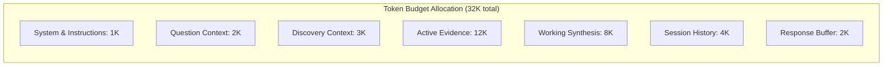
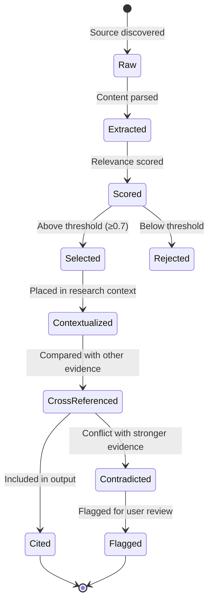

# Research Agent Context Flow

Context management across a multi-turn, multi-source research session.

## Research Context Architecture



## Context Budget by Phase



## Evidence Chunk Lifecycle



## Context Hierarchy by Research Stage

| Stage | Active Context | Token Weight | Eviction Policy |
|-------|---------------|-------------|-----------------|
| Decomposition | Question + Scope | Light (1K) | Static for session |
| First pass discovery | Query history + visited URLs | Medium (3K) | Evict low-relevance queries |
| Deep evidence extraction | Active evidence chunks | Heavy (12K) | Rank → keep top-K per sub-question |
| Cross-analysis | Comparison matrices | Heavy (10K) | Merge duplicate findings |
| Synthesis | Draft + citations | Medium (8K) | Keep until output delivered |

## Failure Modes

| Mode | Symptom | Mitigation |
|------|---------|------------|
| **Source saturation** | Same article cited by multiple paths | Dedup by canonical URL + content hash |
| **Context drift** | Agent forgets original question | Pin question to system prompt; re-anchor after each N iterations |
| **Citation hallucination** | Cites plausible-sounding but false sources | Source verification step: require direct quote extraction |
| **Recency bias** | Overweighs most recently retrieved content | Explicit position bias correction in aggregation |

## Example Research Context State

```json
{
  "research_id": "res_mcp_fc_01",
  "question": "How does MCP compare to OpenAI Function Calling?",
  "sub_questions": [
    {"id": "sq1", "question": "Protocol design differences", "status": "completed", "sources": 4},
    {"id": "sq2", "question": "Tool discovery mechanisms", "status": "completed", "sources": 3},
    {"id": "sq3", "question": "Performance benchmarks", "status": "in_progress", "sources": 2},
    {"id": "sq4", "question": "Production adoption", "status": "pending", "sources": 0}
  ],
  "active_evidence": {
    "total_chunks": 45,
    "selected": 18,
    "rejected": 27,
    "contradictions": [
      {
        "claim": "MCP is faster than FC",
        "sources": ["blog_a", "paper_x"],
        "confidence": 0.6
      }
    ]
  },
  "tokens_used": 14500,
  "budget_remaining": 17500
}
```
