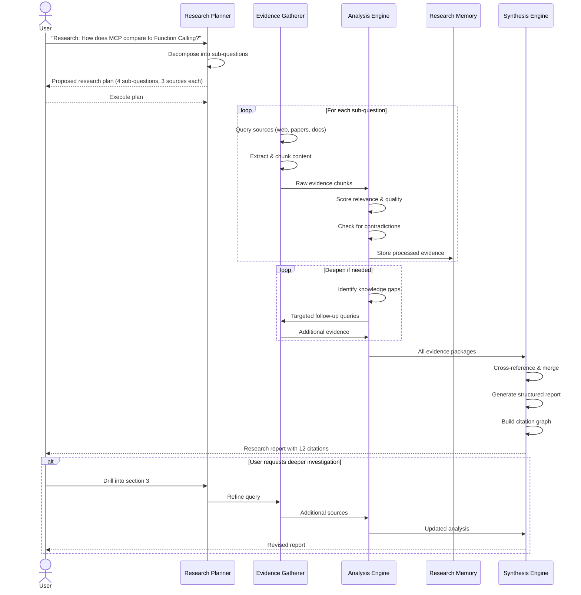
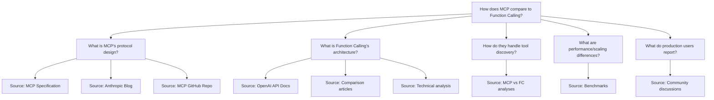

# Research Agent Workflow

Systematic investigation process from question to synthesized report.

## Core Research Loop

## Question Decomposition Strategy

## Quality Scoring Heuristics

| Signal | Weight | Description |
|--------|--------|-------------|
| Source authority | 0.30 | Official docs > peer-reviewed > blog > forum |
| Recency | 0.20 | < 6 months = 1.0, 6-12 mo = 0.7, > 12 mo = 0.4 |
| Relevance | 0.25 | Semantic similarity to research question |
| Fact density | 0.15 | Ratio of claims to total word count |
| Contradiction score | 0.10 | Agreement across multiple sources |

## Iteration Termination Criteria

| Condition | Action |
|-----------|--------|
| All sub-questions have ≥ 3 high-quality sources | Move to synthesis |
| No new evidence after 2 rounds of targeted queries | Accept current evidence and flag gaps |
| Contradiction detected without resolution | Flag contradiction in report |
| Token budget reached | Summarize remaining gaps for extension |
