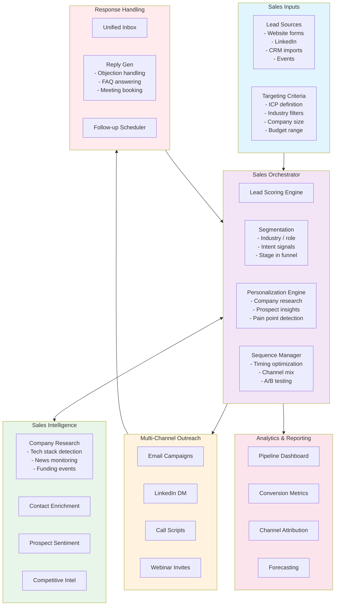

# Sales Agent Architecture

An AI outbound/inbound sales agent that manages leads, personalizes outreach, and orchestrates multi-channel campaigns.

## System Architecture

## Funnel Stages

| Stage | Activity | AI Role | Human Role |
|-------|----------|---------|------------|
| **Prospecting** | Lead identification & enrichment | Automated research & scoring | Define ICP |
| **Outreach** | First contact | Personalized message generation | Approve templates |
| **Nurturing** | Follow-ups & engagement | Sequence management, reply handling | Strategic intervention |
| **Qualification** | BANT/GPCT assessment | Automated qualification conversation | Review qualification |
| **Proposal** | Quote & demo scheduling | Proposal draft, calendar booking | Close deal |

## Extensibility

- **CRM adapters**: Pluggable connectors for Salesforce, HubSpot, Pipedrive
- **Channel modules**: Add new outreach channels via adapter interface
- **Scoring models**: Swappable ML models for lead scoring and intent detection
