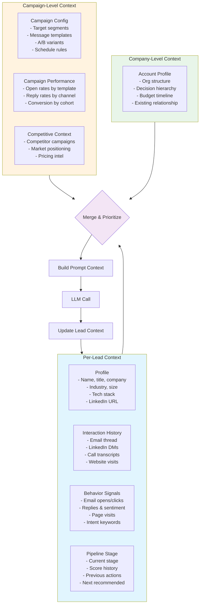
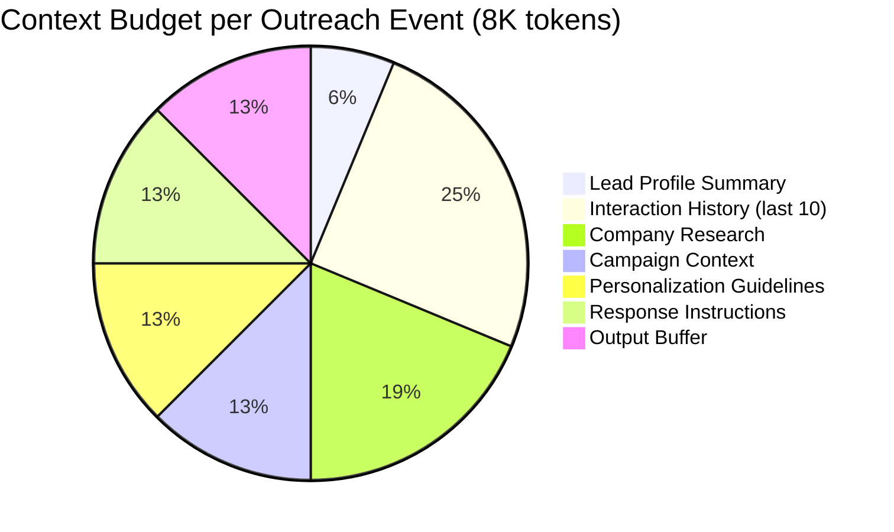

# Sales Agent Context Flow

Managing rich per-lead context across multi-channel, multi-touchpoint sales campaigns.

## Per-Lead Context Structure



## Token Budget by Interaction Type



## Context Sources and Refresh

| Context Layer | TTL | Refresh Event | Priority |
|--------------|-----|---------------|----------|
| Lead profile | Session-long | CRM sync | Critical |
| Interaction history | Per touchpoint | Each new email/call/link | High |
| Company research | 24 hours | Background refresh job | Medium |
| Campaign performance | 1 hour | Metric aggregation | Low |
| Competitive intel | Weekly | Intel refresh | Low |

## Context Prioritization Rules

1. **Recency**: Most recent interaction always included in full
2. **Sentiment flag**: Any negative sentiment interaction forces previous context to remain
3. **Objection tracking**: If an objection was raised, include how it was addressed
4. **Thread continuity**: For reply handling, include the last 5 messages of the thread fully, previous turns summarized
5. **Call context**: Call transcripts are summarized, not embedded raw (unless < 2K tokens)

## Failure Modes

| Mode | Symptom | Mitigation |
|------|---------|------------|
| **Context confusion** | Confuses two leads with similar names | Always include lead ID + company + role in context anchor |
| **Repetitive outreach** | Sending same message to same lead twice | Interaction dedup: check content hash before generation |
| **Stale company context** | References old funding/news | Tag company context with last update timestamp; refresh on trigger |
| **Channel bleed** | References LinkedIn DM in an email | Track per-channel context separately; merge only for summary |

## Example Lead Context Snapshot

```json
{
  "lead_id": "lead_789",
  "company": "Acme Corp",
  "contact": {
    "name": "Jane Chen",
    "title": "VP Engineering",
    "linkedin": "linkedin.com/in/jane-chen",
    "industry": "Fintech",
    "company_size": "500-1000"
  },
  "score": 82,
  "tier": "hot",
  "stage": "Active Outreach",
  "interactions": [
    {"type": "email", "direction": "sent", "date": "2026-06-01", "sentiment": "neutral"},
    {"type": "email_open", "date": "2026-06-02", "confirmed": true},
    {"type": "linkedin_message", "direction": "received", "date": "2026-06-03",
     "content": "Interesting, can you share a case study?", "sentiment": "positive"}
  ],
  "company_context": {
    "tech_stack": ["AWS", "Python", "Kubernetes"],
    "recent_funding": {"series": "C", "amount": "$50M", "date": "2026-03"},
    "key_initiatives": ["AI/ML infrastructure", "API platform v3"]
  },
  "next_action": "Send case study: ACME Corp + AI Infrastructure",
  "total_tokens": 4200
}
```
