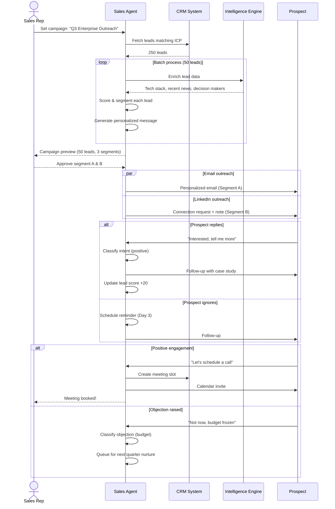
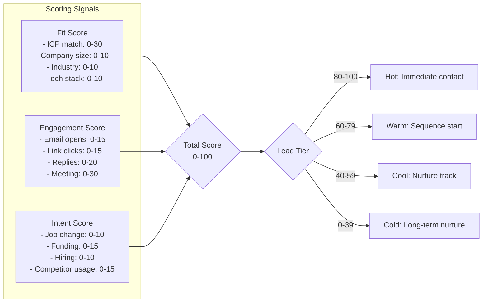

# Sales Agent Workflow

End-to-end lead-to-meeting pipeline with AI-driven outreach and human-in-the-loop gates.

## Lead Engagement Flow



## Lead Scoring Model



## Outreach Cadence

```mermaid
gantt
    title Outreach Sequence
    dateFormat  D
    axisFormat  %a

    section Email
    Email 1 (Intro)          :a1, 0, 1d
    Email 2 (Value Prop)      :a2, after a1, 1d
    Email 3 (Case Study)      :a3, after a2, 1d
    Email 4 (Breakup)         :a4, after a3, 1d

    section Social
    LinkedIn Request          :b1, 0, 1d
    LinkedIn Follow-up        :b2, after b1, 2d

    section Phone
    Call Attempt 1            :c1, after a2, 1d
    Call Attempt 2            :c2, after a3, 1d
```

## Decision Gates

| Gate | Condition | Action |
|------|-----------|--------|
| Reply received | Any positive signal | Switch to conversational mode |
| Bounce detected | Email hard bounce | Remove from list, flag CRM |
| Unsubscribe | Opt-out event | Remove immediately, suppress forever |
| Meeting booked | Calendar event created | Transfer to SDR queue, pause outreach |
| Negative sentiment | Angry/negative reply | Flag for human review, pause sequence |
