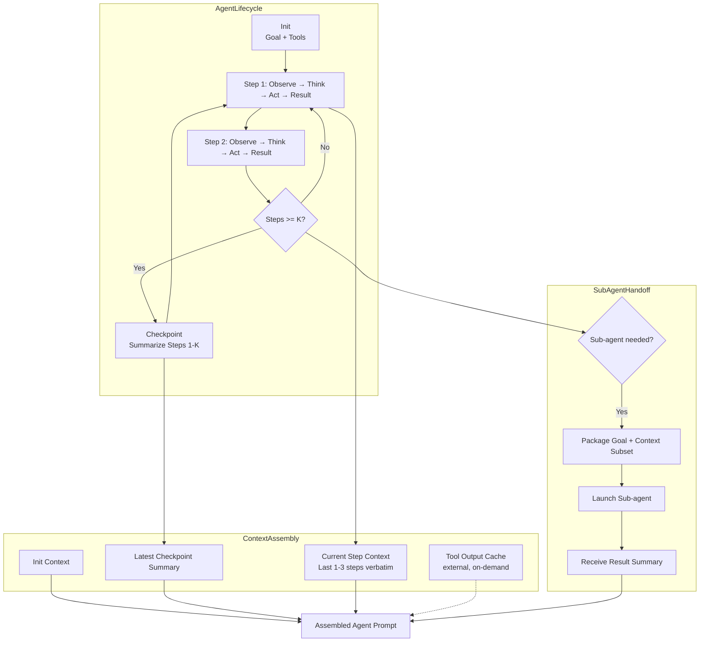

# Agent Context Management Pattern

Manage the context lifecycle for AI agents across tool calls, multi-step reasoning, sub-agent delegation, and external integrations—ensuring the agent always has the information it needs without exceeding context limits.

## Problem

Autonomous agents execute multi-step tasks involving tool calls, external data retrieval, reasoning chains, and sometimes sub-agent delegation. This creates unique context challenges:

- **Context Accumulation:** Each tool call adds input parameters + output results to the context. After 5–15 tool calls, the history alone may exceed context limits.
- **Tool Output Sprawl:** A single web search or file read can return 10K–50K tokens that overwhelm the agent's working context.
- **Reasoning Path Bloat:** Agents that "think step by step" (Chain-of-Thought, ReAct, Tree-of-Thought) generate verbose intermediate reasoning that consumes budget without contributing to the final output.
- **Sub-Context Confusion:** When delegating to sub-agents, the parent may lose track of what the child did or mix its own context with the child's result.
- **Feedback Loop Noise:** Subsequent steps may re-read previous tool outputs or reasoning steps, creating redundant context accumulation.

Without structured management, agents suffer from "context poisoning": the prompt becomes so large and noisy that the agent cannot effectively focus on the current step, leading to loops, hallucinations, or crashes.

## Solution

Agent Context Management (ACM) provides a structured lifecycle for agent context across execution phases:

### Phase 1: Init (Goal + Constraints)
Set the agent's mission, boundaries, and available tools. This context is retained for the entire run but typically small (<1K tokens).

### Phase 2: Execute (Step-by-Step)
Each step produces a compact context record:
- **Observation:** What the agent perceived (tool output summary, not raw output).
- **Thought:** The agent's reasoning (compressed—max N tokens per thought).
- **Action:** What tool was called, with a parameter summary (not full params).
- **Result:** Tool result summary (truncated/extracted, not full output).

### Phase 3: Summarize (Checkpoint)
After each K steps (configurable, default 5), compress the step history into a progress summary. This becomes the "current state" context, replacing the raw step history.

### Phase 4: Handoff (Sub-Agent Boundary)
When delegating to a sub-agent: pass only the goal + relevant context subset. The sub-agent builds its own context from scratch. The parent receives only the sub-agent's result summary, not its internal context.

### Phase 5: Finalize (Result Assembly)
The agent assembles the final answer from the compressed execution log + final tool results, discarding intermediate reasoning.

## Architecture



**Context slot budget allocation:**

| Slot | Purpose | Token Budget | Strategy |
|---|---|---|---|
| Mission | Goal, constraints, tools | 5–10% | Static, retained entire run |
| Checkpoint | Compressed step history | 25–35% | Summarize every K steps |
| Recent Steps | Last 1–3 steps verbatim | 20–25% | Sliding window |
| Tool Outputs | Current tool result | 20–30% | Summarize/triaged per call |
| Sub-agent Results | Delegation outcomes | 10–15% | Compact result summary only |

## Tradeoffs

| Strategy | Benefits | Costs |
|---|---|---|
| **Verbose reasoning with checkpoint** | Preserves reasoning quality; explicit summarization points | Summarization LLM cost; potential information loss at checkpoint |
| **Early truncation** | Simple to implement; guarantees budget | Loses all intermediate reasoning; agent may repeat work |
| **Selective retention** | Keeps only task-relevant history | Requires per-step relevance classification; classification may err |
| **Sub-agent isolation** | Clean context boundaries; parallel execution possible | Overhead of serialization/deserialization; parent blind to sub-agent internals |

## Example Workflow

```text
1. INIT: Agent mission—"Research and summarize the latest papers on context compression"
2. STEP 1: Search arxiv for "context compression 2025" → return 20 results
3. STEP 2: Fetch top 3 papers → each paper ~5K tokens
4. CHECKPOINT (step 2): "Searched arxiv, found 20 papers. Fetched top 3 by relevance score."
5. STEP 3: Read paper 1 → extracted key technique (extractive + abstractive hybrid)
6. STEP 4: Read paper 2 → extracted key technique (learned compression with feedback)
7. CHECKPOINT (step 4): "Read 2 papers: hybrid extractive-abstractive approach and learned compression."
8. STEP 5: Read paper 3 → extracted technique (token-level pruning with importance scores)
9. FINALIZE: Assemble summary of all 3 papers from compressed checkpoint + fresh paper 3 notes
10. Total context: 35K tokens without ACM → 8K tokens with ACM
```

## Example Prompt

```text
You are an AI agent with structured context management.

MISSION (retained entire run):
{agent_mission}

PROGRESS SUMMARY (compressed from steps 1-{checkpoint}):
{checkpoint_summary}

CURRENT STEP (verbatim, last 1-3 actions):
{tool call input/output here}

AVAILABLE TOOL RESULTS (summarized):
{current_tool_output}

Instructions:
- Use PROGRESS SUMMARY to understand what has been done so far
- Use CURRENT STEP for the immediate action and result
- When calling tools, request only the specific information needed
- After every {K} steps, provide a concise progress checkpoint when asked
- When delegating to sub-agents, provide only the goal and a minimal context subset
```

## Failure Modes

| Mode | Symptom | Cause | Mitigation |
|---|---|---|---|
| **Checkpoint Information Loss** | Agent repeats actions already completed | Checkpoint summary omits key state details | Make summary format structured (templated fields); require explicit state enumeration |
| **Tool Output Spill** | Token budget exhausted before task completes | Tool returns large output that is not summarized | Cap per-tool output at 1K tokens; retrieve full output on demand only |
| **Sub-Agent Oversight** | Parent unaware of sub-agent actions | No feedback channel from sub-agent | Require sub-agent to emit structured result summary + key decisions |
| **Context Slippage** | Agent forgets the original mission mid-task | Mission context pushed out by accumulated step data | Pin mission context at the start of every assembled prompt; never evict |
| **Loops Without Checkpoint** | Agent repeats the same action at steps 10+ | Compounding verbosity without summarization checkpoint | Mandatory checkpoint every K steps; loop detection via action sequence comparison |

## Production Considerations

- **Adaptive Checkpoint Frequency:** K=5 for simple tasks, K=3 for complex tool-heavy tasks. Monitor step history growth and adjust K dynamically.
- **Tool Output Categorization:** Pre-classify tool outputs: small (pass through), medium (summarize), large (store externally, pass summary only). This prevents surprise token spikes.
- **Checkpoint Validation:** After summarization, run a consistency check: "Does the compressed summary retain all named entities and decisions from the covered steps?" If not, retry with a larger summary budget.
- **Bounded Step Limit:** Enforce a hard limit on total steps per run (e.g., 25). After the limit, force a finalize phase. Prevents infinite loops that exhaust context and budget.
- **Observability:** Log step count, token consumption per slot, checkpoint events, and sub-agent handoffs. Alert on >X% token usage per slot.
- **Testing:** Run agents against a benchmark suite of multi-step tasks. Measure task completion rate, total steps, total tokens consumed, and checkpoint accuracy (manual review of a subset).
