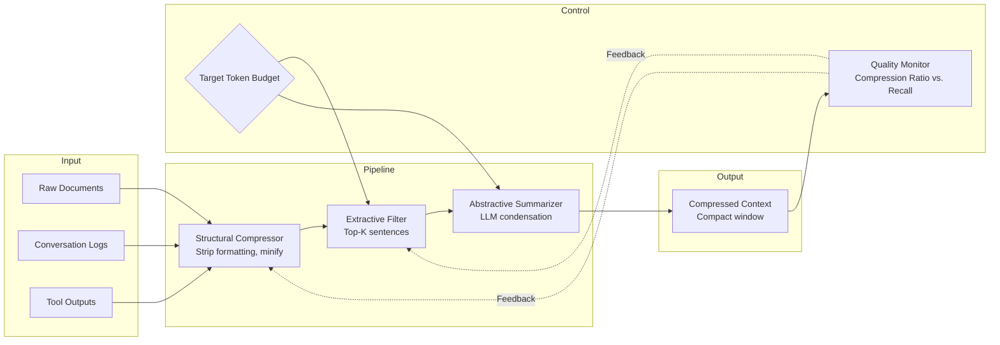

# Context Compression Pattern

Reduce the token footprint of contextual information by applying lossy or lossless compression techniques, preserving semantic meaning while minimizing the prompt size sent to the LLM.

## Problem

LLM context windows have hard token limits. As context grows—via retrieved documents, conversation history, tool outputs, or intermediate reasoning—the cost, latency, and risk of exceeding limits increase. Uncompressed context leads to:

- **Token Waste:** Verbose documents or logs contain repetitive boilerplate, formatting whitespace, and low-information content that consumes budget without adding value.
- **Context Overshoot:** Retrieved chunks from RAG, full conversation logs, and tool call traces often sum to more than the model's context window.
- **Inverse Scaling:** Some models degrade in recall accuracy when context is very long, even within limits (the "lost-in-the-middle" effect).
- **Cost Proliferation:** At $3–$15 per million input tokens (GPT-4o, Claude 3.5), every uncompressed kilobyte has direct economic cost at scale.

## Solution

Context Compression applies a processing pipeline that reduces token count before the prompt is assembled:

1. **Structural Compression:** Strip Markdown formatting, remove redundant whitespace, collapse repeated boilerplate, minify JSON/XML structures while preserving semantic keys.
2. **Extractive Compression:** Select the K most salient sentences or passages from a larger document using text-rank, embedding similarity, or cross-encoder relevance scoring.
3. **Abstractive Compression:** Generate a condensed summary via a fast, cheap LM (or the same LM with a compression instruction) that captures the essential information.
4. **Specialized Encoders:** For structured data (logs, traces, DB rows), use targeted templates that pack information densely (e.g., CSV rows → key-value pairs, log lines → structured event tuples).

The pattern composes these techniques in a pipeline where compression ratio increases with each stage but information loss also accumulates.

## Architecture



**Compression stages and ratios:**

| Stage | Typical Ratio | Quality Impact | Cost |
|---|---|---|---|
| Structural | 1.2–2× | Negligible (lossless) | Free |
| Extractive | 2–8× | Low–Medium (may lose context) | Cheap (embedding) |
| Abstractive | 3–15× | Medium–High (paraphrase loss) | Medium (LLM call) |
| Combined Pipeline | 5–40× | Depends on composition | Medium+ |

## Tradeoffs

| Approach | When to Use | Risk |
|---|---|---|
| **Structural only** | User input already concise; just need cleanup | Insufficient ratio for large docs |
| **Extractive only** | Source is reference material where exact phrasing doesn't matter | May miss nuanced meaning that spans sentences |
| **Abstractive only** | Need maximum compression; downstream model can tolerate paraphrased input | Hallucination or information loss from the compressor |
| **Hybrid pipeline** | Production RAG pipelines handling varied content | Complexity; need to tune thresholds for each stage |

## Example Workflow

```text
1. RAG system retrieves 8 document chunks (12,400 tokens total)
2. Token budget allocates 4,000 tokens for retrieved context
3. Pipeline runs:
   a. Structural: strip formatting, deduplicate headers → 10,200 tokens
   b. Extractive: BERT-score each sentence against query, keep top 40% → 4,080 tokens
   c. Abstractive: LLM condenses to 3,800 tokens with instruction "Summarize the key findings, preserving all technical numbers and citations"
4. Final compressed context: 3,800 tokens (3.2× compression, 92% answer accuracy in eval)
5. Budget headroom (200 tokens) used for additional retrieved chunk
```

## Example Prompt

```text
Compress the following technical documentation to at most 400 tokens.
Preserve ALL version numbers, API endpoints, parameter names, and error codes.
Remove Markdown formatting, examples, and explanatory prose.
Output as a dense bullet list.

SOURCE:
[docs text]

COMPRESSED OUTPUT:
```

## Failure Modes

| Mode | Symptom | Cause | Mitigation |
|---|---|---|---|
| **Over-Compression** | Model misses critical details | Abstractive stage dropped specific numbers or conditions | Set per-field preservation rules (e.g., "always keep numbers and names"); validate with unit tests |
| **Compressor Hallucination** | Summary contains facts not in source | Small or untuned LM used for abstraction | Use a verified summarizer; cross-check factual precision on a held-out eval set |
| **Latency Spike** | Prompt assembly adds 2–5s | Extractive reranking or abstractive generation on critical path | Cache compression results per document-ID; run pipeline asynchronously |
| **Inconsistent Ratio** | Some compressions barely reduce tokens | Short or already-dense source content | Skip compression when source is under budget; apply only structural pass |

## Production Considerations

- **Budget-Aware Compression:** Never hard-code compression ratios. Compute dynamically from actual source token count and remaining budget.
- **Caching Layer:** Cache compression output per (source_hash + target_budget). Bust cache when source content changes.
- **Quality Gates:** Run a fast validation check after compression (e.g., does the compressed version contain all named entities from the original?). If validation fails, fall back to extractive-only.
- **Tiered Compression:** Use different compression strategies per content type: structural for logs, extractive for web pages, abstractive for research papers.
- **Observability:** Log compression ratio, applied strategies, latency per stage, and downstream answer quality. Set alert thresholds: <2× ratio for non-trivial sources, >500ms pipeline latency.
- **Testing:** Maintain a compression eval set of 100+ inputs with manually verified compressed outputs. Regression-test on every pipeline change.
