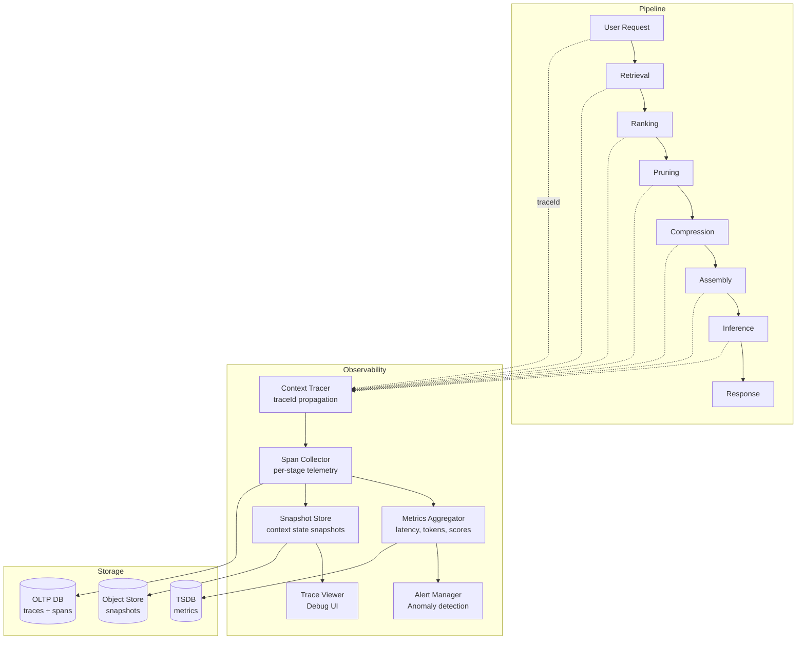

# Context Observability Pattern

Instrument the full context engineering pipeline—retrieval, assembly, compression, ranking, pruning, and model interaction—with structured telemetry for debugging, performance monitoring, and continuous improvement.

## Problem

Context engineering pipelines are complex compositions of multiple stages: retrieval from various sources, chunking, embedding, ranking, pruning, compression, prompt assembly, and LLM inference. When the system produces poor answers, the root cause is nearly impossible to determine without observability:

- **Black-Box Prompt Assembly:** The final prompt submitted to the LLM contains context from many sources. When the answer is wrong, which source caused the error? Was relevant context missing? Was irrelevant context included?
- **Silent Failures:** A retrieval stage might fail silently (empty results, wrong embeddings, bad chunk boundaries) while the pipeline continues with stale or missing context.
- **Performance Regression:** After a change to chunk size, ranking weights, or compression ratio, answer quality may degrade without obvious signals. Without telemetry, regressions go unnoticed until user complaints.
- **Cost Attribution:** Without per-stage telemetry, it's impossible to know which part of the pipeline consumes the most tokens, latency, or API cost.
- **Debugging Nightmares:** Reproducing a bad answer requires reconstructing the exact context assembly state—which sources were queried, which chunks were retrieved, which ranking scores were assigned—none of which is captured in production logs.

## Solution

Context Observability instruments every stage of the context pipeline with structured, tracable telemetry:

### Core Data Model: Context Trace

Every request generates a `ContextTrace` containing:
- **traceId:** Unique request identifier propagated across all stages.
- **stageSpans:** Each pipeline stage (retrieval, ranking, pruning, compression, assembly, inference) records a span with:
  - Start/end timestamps and duration.
  - Input size (token count, item count).
  - Output size.
  - Configuration parameters (model, threshold, top-K).
  - Errors or warnings.
- **contextSnapshots:** Key context state at assembly points (what was included, what was excluded, with scores/reasons).
- **interactionMetadata:** User query, final answer, feedback score (if available).

### Instrumentation Points

| Stage | Telemetry Collected | Value |
|---|---|---|
| Query understanding | Parsed intent, extracted entities, query embedding | Verify query processing correctness |
| Retrieval | Sources queried, chunks retrieved, per-chunk scores | Measure retrieval precision/recall |
| Ranking | All candidate scores, final rank, filtered items | Debug ranking quality; detect score saturation |
| Pruning | Items pruned with reason, reduction ratio | Verify pruning isn't removing important content |
| Compression | Compression ratio, technique used, quality check pass/fail | Detect over-compression |
| Assembly | Final prompt structure (sections, sizes, order), budget utilization | Validate budget allocation correctness |
| Inference | Token usage (prompt + completion), latency, model name | Cost attribution; performance monitoring |

## Architecture



**Key telemetry metrics:**

| Metric | Type | Alert Threshold |
|---|---|---|
| Retrieval Latency p95 | Histogram | >500ms |
| Context Assembly Duration | Histogram | >2s |
| Total Prompt Tokens | Gauge | >85% of limit |
| Compression Ratio | Gauge | <1.5x for >5000 token sources |
| Empty Retrieval Rate | Counter | >5% of requests |
| Stage Error Rate | Counter | >1% |
| Score Saturation Events | Counter | >0 over 1h |

## Tradeoffs

| Approach | Benefits | Costs |
|---|---|---|
| **Full trace every request** | Complete debuggability | Storage cost; pipeline latency overhead (5–15%) |
| **Sampled tracing (1:100)** | Low overhead; good for performance monitoring | Hard to debug rare issues; missing context for intermittent failures |
| **Snapshot-only** | Low storage; captures final state | No timing/performance data; can't replay for debugging |
| **Post-hoc analysis (logs)** | Simple to implement; zero latency impact | No structured spans; hard to correlate across stages |

## Example Workflow

```text
1. User sends query: "Explain the chunking strategy in langchain"
2. traceId: ctx_trace_a1b2c3d4 generated and propagated
3. Retrieval span: 120ms, 3 sources queried, 15 chunks retrieved, 0 errors
4. Ranking span: 45ms, 15 candidates scored, threshold 0.4, 8 passed
5. Pruning span: 12ms, removed 2 duplicate chunks, reduction 18%
6. Compression span: 350ms, extractive (ratio 2.3x), quality check PASS
7. Assembly span: 8ms, budget 4K/6K tokens, sections: retrieved(3.2K) + instruction(0.5K) + format(0.3K)
8. Inference span: 2.4s, 4K prompt + 500 completion, Claude Sonnet 4
9. Trace stored; metrics updated; dashboard refreshes
10. Developer queries: "show me all traces with compression ratio < 1.5x in last 24h"
```

## Example Prompt

```text
Context Observability Debug Query:

traceId: ctx_trace_a1b2c3d4

SPANS:
- retrieval: 120ms, ok, 15 chunks
- ranking: 45ms, ok, 8/15 passed
- pruning: 12ms, ok, -2 items
- compression: 350ms, ratio=2.3x, ok
- assembly: 8ms, 4K tokens used
- inference: 2.4s, 4K+500 tokens, Sonnet 4

USER QUERY:
"Explain the chunking strategy in langchain"

FINAL ANSWER (abbreviated):
"LangChain uses recursive character text splitter..."

DIAGNOSE:
- Was ranking effective? 8/15 passed threshold; score distribution: 0.2–0.9
- Were any high-relevance chunks pruned? 2 removed (duplicates) — check originals in snapshot
- Any performance concerns? Compression latency is elevated (350ms vs 200ms baseline)
```

## Failure Modes

| Mode | Symptom | Cause | Mitigation |
|---|---|---|---|
| **Trace Sampling Misses Bug** | Intermittent bad answer with no trace | Trace sampled at 1% rate; bad answer not sampled | Increase sampling for error/corner cases; always trace if any stage returns error |
| **Storage Bloat** | Millions of traces consume TB-level storage | Every request fully traced with snapshots | Snapshot only on error or sampled (1%); use TTL-based retention (7d traces, 30d metrics) |
| **Instrumentation Overhead** | Pipeline latency increased 20%+ | Synchronous telemetry collection on each stage | Use async/batch telemetry emission; never block pipeline on observability |
| **Metric Noise** | Alert fatigue from false positives | Thresholds set too aggressively | Use dynamic baselining (past 7 days) + anomaly detection instead of static thresholds |

## Production Considerations

- **Trace Sampling Strategy:** Trace 100% of requests with any error. Trace 10% of successful requests (adjustable). Always trace requests from debug/tests. Use identity-based sampling for internal users.
- **Storage Architecture:** Traces and spans go to a low-latency OLTP store (for recent queries). After 48 hours, aggregate into TSDB and delete raw traces. Snapshots go to S3/GCS with 30-day retention.
- **Correlation IDs:** Propagate traceId via HTTP headers, message queues, and log contexts. This enables end-to-end correlation even across microservices.
- **Debug Endpoint:** Provide an API endpoint: `GET /traces/{traceId}?format=full` that returns the complete trace including context snapshots for manual inspection.
- **Cost Attribution Dashboard:** Show per-stage token consumption and LLM cost. Top-level view: cost/request, tokens/request, stages/request. Break down by deployment, user segment, query type.
- **Testing:** Synthetic trace injection tests: send known-bad queries and verify that alerting fires. Load-test the observability pipeline itself to ensure it can handle 10x normal traffic without backpressure.
