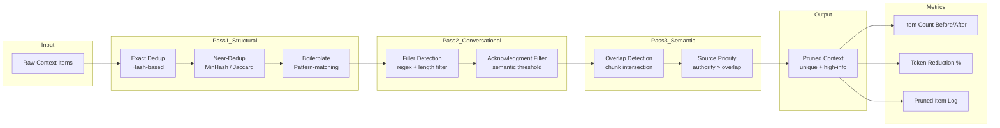

# Context Pruning Pattern

Systematically remove low-value, redundant, or irrelevant content from the context window using deterministic rules and structural analysis, prior to any ranking or compression stage.

## Problem

Context windows often contain content that is structurally present but semantically or practically unnecessary. Log output includes repeated health-check pings. Conversation transcripts include greetings, confirmations, and filler. RAG chunks overlap in content due to sliding-window chunking. This content:

- **Consumes budget for zero value:** Repeated boilerplate, acknowledgments ("Got it!", "Thanks"), and overlapping chunk boundaries eat token budget without contributing to the model's understanding.
- **Increases noise floor:** Redundant information competes with unique content, reducing the model's ability to identify truly novel signals.
- **Compounds with compression:** Compression algorithms waste capacity on redundant information that could simply be removed.
- **Hides edge cases:** When 70% of context is near-duplicate, the remaining 30% of unique, important information is diluted among it.

## Solution

Context Pruning applies lightweight, deterministic filters before any scoring or compression step. Pruning operates in three passes:

### Pass 1: Structural Deduplication
Remove or collapse content based on structural patterns:
- **Exact Duplicates:** Same text appearing in multiple chunks (common with sliding-window overlap).
- **Near-Duplicates:** Jaccard similarity >0.85 between consecutive chunks; keep the longer or more recent.
- **Boilerplate Removal:** Strip signature blocks, auto-reply footers, repeated headers, standard log prefixes.

### Pass 2: Conversational Noise Filtering
For multi-turn interactions, remove turns with negligible information density:
- Single-word acknowledgments ("ok", "thanks", "yes") unless directly responding to a substantive question.
- System-status messages ("Waiting for input...", "Processing...").
- Repeated user corrections that resolved to the same final instruction.

### Pass 3: Semantic Overlap Reduction
When multiple sources cover the same ground:
- **Chunk Merging:** Sliding-window chunks with >60% overlap are merged, keeping the union of unique sentences.
- **Source Prioritization:** If a canonical doc and a forum answer cover the same API, keep only the canonical doc.

## Architecture



**Pruning targets by content type:**

| Content Type | Typical Reduction | Pruning Techniques | Risk |
|---|---|---|---|
| Chat logs | 20–40% | Filler removal, acknowledgment dedup | May remove contextually important filler (hesitation → uncertainty) |
| RAG chunks | 15–30% | Sliding-window overlap dedup, near-duplicate collapse | May lose unique info from chunk boundaries |
| Tool/API logs | 40–60% | Boilerplate stripping, repeated check intervals | May remove temporal patterns |
| Email threads | 25–35% | Signature stripping, quoted-text dedup | May lose quoted resolution context |

## Tradeoffs

| Approach | Pros | Cons | Best For |
|---|---|---|---|
| **Regex boilerplate removal** | Fast, deterministic, cheap | Brittle to format changes; misses semantic noise | Clean logs, structured outputs |
| **MinHash near-dedup** | Detects structural similarity without embedding cost | Threshold tuning; false positives on similar but distinct content | RAG chunk deduplication |
| **Semantic overlap merge** | Preserves unique sentences from both chunks | Requires sentence segmentation and embedding | Academic papers, long-form docs |

## Example Workflow

```text
1. Raw context: 50 items, 8,200 tokens
2. Pass 1 (Structural): Remove 5 exact duplicate chunks (≈200 tokens), collapse 3 near-duplicate log lines (≈150 tokens)
3. Pass 2 (Conversational): Filter 8 filler acknowledgments (≈40 tokens), remove 2 "Processing..." system messages (≈20 tokens)
4. Pass 3 (Semantic): Merge 4 overlapping RAG chunks (≈600 → 380 tokens)
5. Final: 28 items, 5,190 tokens (37% reduction)
6. Pruned output fed into ranking → compression → prompt assembly
```

## Example Prompt

```text
Context Pruning Instructions:

You are a context pruning module. Given a list of context items, identify which should be REMOVED:

Rules:
- Exact duplicates → remove all but one
- Items shorter than 10 tokens that are acknowledgments ("thanks", "ok", "got it") → remove
- Consecutive chunks with >80% word overlap → merge
- Log lines that repeat the same status code at 5s intervals → keep only first and last

Output the filtered item list with REMOVED items marked and removal reason.
```

## Failure Modes

| Mode | Symptom | Cause | Mitigation |
|---|---|---|---|
| **Over-Pruning** | Model misses context that was important | Filler filter too aggressive; structural dedup removed distinct content | Set conservative thresholds initially; audit pruned items in logs |
| **Under-Pruning** | Negligible token savings | Thresholds too loose; content has little detectable redundancy | Adjust via A/B testing on observed reduction rates |
| **Format Brittleness** | Regex patterns stop working after content format change | Boilerplate rules hard-coded to specific format version | Use content-type detectors + parameterized patterns; alert when match rate drops |
| **False Merge** | Two distinct but similar chunks merged into one, losing distinction | Overlap threshold too low (e.g., <80%) for distinct topics | Raise overlap threshold; add topic-segmentation guard |

## Production Considerations

- **Prune Before Rank:** Pruning removes content cheaply; ranking then allocates budget efficiently to the survivors. Pruning-first reduces ranking workload by 20–40%.
- **Audit Trail:** Log every pruned item with reason and original position. Essential for debugging information loss issues.
- **Content-Type Routing:** Maintain per-content-type pruning configurations. Chat pruning differs from log pruning differs from document pruning.
- **Safety Margin:** Never prune to exactly the token limit. Leave a 10% safety margin to account for tokenizer estimation variance.
- **Rolling Hash for Dedup:** Use SimHash or MinHash signatures for O(1) near-duplicate lookups instead of pairwise comparison O(n²).
- **Testing:** Build a test corpus of known-redundant content and verify removal. Also verify that critical unique content is never pruned.
