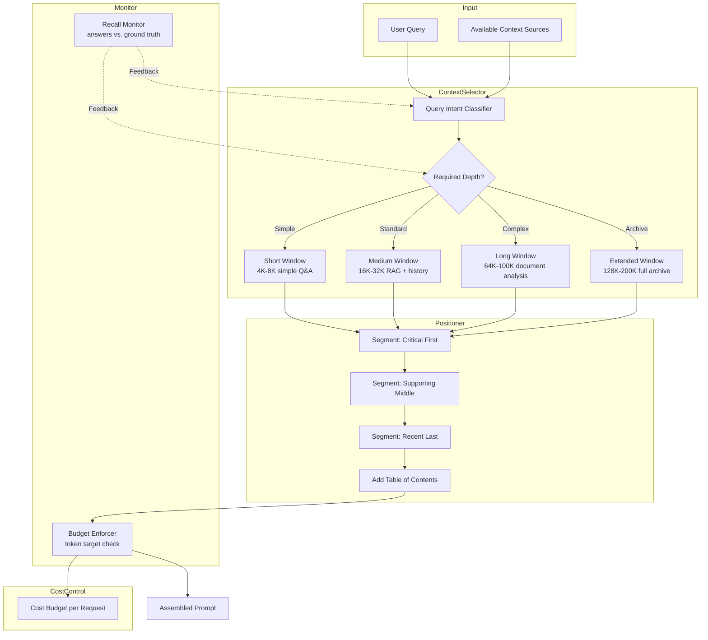

# Long Context Strategies Pattern

Design systems that effectively leverage long-context models (128K–2M+ token windows) while managing the practical challenges of cost, latency, retrieval accuracy, and the lost-in-the-middle phenomenon.

## Problem

Modern LLMs support context windows of unprecedented size—Claude 3.5 Sonnet (200K), Gemini 2.0 (1M+), GPT-4-128K, and Llama 3.1 (128K). However, simply filling these large windows creates new challenges:

- **Lost-in-the-Middle:** Even within supported limits, model recall accuracy drops significantly for information placed in the middle of the prompt. Performance on middle-positioned content can be 20–40% lower than content at the beginning or end.
- **Linear Cost Scaling:** At $3–$15/M input tokens, a 128K prompt costs $0.40–$1.90 per request. At scale (10M requests/month), this translates to $4M–$19M/month if every request uses the full window.
- **Latency Degradation:** Processing long contexts increases time-to-first-token proportionally (roughly O(n²) for full attention, though optimized architectures reduce this). A 128K prompt can add 5–15s to response time.
- **Diminishing Returns:** Beyond a certain window size (typically 40K–60K tokens for most use cases), additional context provides marginal accuracy improvement while cost and latency continue to grow linearly.
- **Noise Amplification:** More context means more irrelevant information, which can actively degrade answer quality by distracting the model from relevant content.

## Solution

Long Context Strategies combine selective context loading, positional optimization, and window management to extract maximum value from long context capabilities:

### Strategy 1: Positional Optimization
- **Critical content first** — Place the most important context (query, instructions, key facts) at prompt beginning.
- **Recent content last** — Place recent conversation turns, latest data at prompt end (recency bias).
- **Supporting content middle** — Place supplementary docs, reference material, retrieved chunks in the middle, with the understanding that recall will be lower.

### Strategy 2: Tiered Context Loading
Instead of filling the entire window, load context in tiers:
- **Tier 1 (Always):** Query, instructions, pinned facts, current state. ~5–10K tokens.
- **Tier 2 (High Priority):** Recently retrieved chunks, conversation history (last N turns). ~20–40K tokens.
- **Tier 3 (On-Demand):** Historical archives, full documents, reference material. Loaded only when Tier 1+2 lack sufficient context, or when the model explicitly requests more information via tool use.

### Strategy 3: Segmented Attention
For structured context, partition the window into labeled segments and include a table of contents at the start. This helps the model locate and attend to specific sections:
```text
DOCUMENT STRUCTURE:
[001–050] Executive Summary
[051–200] Technical Architecture
[201–350] API Reference
[351–500] Deployment Guide
```

### Strategy 4: Adaptive Window Sizing
Dynamically adjust the context window size based on task complexity and model performance:
- **Simple lookups:** 4K–8K
- **Standard Q&A with RAG:** 16K–32K
- **Complex analysis with document review:** 64K–100K
- **Full codebase or book analysis:** 128K–200K+

## Architecture



**Window size vs. performance characteristics (empirical observations):**

| Window Size | Token Cost (Sonnet 4 @ $3/M) | TTFT Impact | Recall Accuracy (Middle) | Best For |
|---|---|---|---|---|
| 4K | $0.012 | Baseline | ~95% | Simple Q&A |
| 16K | $0.048 | +0.5s | ~92% | Standard RAG |
| 32K | $0.096 | +1.5s | ~85% | Conversations with history |
| 64K | $0.192 | +3.5s | ~75% | Multi-doc analysis |
| 128K | $0.384 | +8s | ~60% | Full codebase/book review |
| 200K | $0.60 | +15s | ~50% | Archive-wide search |

## Tradeoffs

| Strategy | When to Use | Key Risk |
|---|---|---|
| **Positional optimization** | Always, regardless of window size | Insufficient if context requires middle recall |
| **Tiered loading** | Production systems with varied query complexity | Classification errors: complex query may get short window |
| **Segmented attention** | Structured documents, codebases, reference manuals | Header tokens consume budget; useless for narrative text |
| **Adaptive sizing** | Cost-sensitive production | Overhead of query classification; window-switching latency |

## Example Workflow

```text
1. User query: "Summarize the key changes in the authentication module across the last 6 months of commits"
2. Intent classifier: COMPLEX_DOC_ANALYSIS → allocate 64K window
3. Context selector retrieves:
   - Tier 1 (always): Query + analysis instructions = 2K tokens
   - Tier 2 (high priority): Git log for last 6 months (summarized) = 15K tokens
   - Tier 3 (on-demand): Key diff excerpts = 20K tokens
4. Positioner arranges:
   - [BEGIN] Query + instructions + TOC (high recall zone)
   - [MIDDLE] Git log summaries + diff excerpts (lower recall expected)
   - [END] Recent commits from last 2 weeks (recency bias zone)
5. Budget check: 37K/64K tokens used. 27K headroom available.
6. Agent produces summary. Recall monitor compares key facts against ground truth.
7. If recall < 80%, classifier adjusts window size for future similar queries.
```

## Example Prompt

```text
You have a 100K token context window organized as follows:

=== CRITICAL (will be recalled best — place here what you must not miss) ===
{query, instructions, immediate facts}

=== SUPPORTING (reference material, supplementary context) ===
{retrieved documents, extended context}

=== RECENT (latest data, recent conversation turns) ===
{recent_chat_history, latest_results}

=== DOCUMENT STRUCTURE ===
This prompt is organized in sections as above. Critical content is at the beginning and recent content is at the end. If you need to reference information from the Supporting section, you may need to search more carefully — it is in the middle of your context window.
```

## Failure Modes

| Mode | Symptom | Cause | Mitigation |
|---|---|---|---|
| **Middle Oblivion** | Model fails to use reference docs in the middle of the window | Lost-in-the-middle effect at large window sizes | Use segmented attention with TOC; reduce middle section size; move most critical references to beginning |
| **Cost Shock** | Unexpectedly high API bills | Adaptive sizing misclassifies queries as complex; or tier 3 loads too aggressively | Enforce per-request cost caps; fail gracefully when budget exceeded |
| **Latency Regression** | Response time doubles after model update | New model version has different scaling characteristics with long contexts | Benchmark each model version with standard window sizes; set per-model window limits |
| **Context Pollution** | Irrelevant long documents degrade answer quality | Over-retrieval fills the window with noise | Apply stricter relevance thresholds for long contexts; run noise-reduction pass |

## Production Considerations

- **Start Small, Scale Up:** Default to the smallest adequate window size. Only increase when evidence shows recall gaps. Apply the "minimum viable context" principle—add context until accuracy plateaus, then stop.
- **Positional Budgeting:** Allocate 20% of tokens for critical beginning section, 60% for supporting middle, 20% for recent end section. Adjust based on observed answer quality per section.
- **Model-Specific Tuning:** Different models have different "lost-in-the-middle" curves. GPT-4o loses recall faster than Claude 3.5 Sonnet beyond 64K. Tune window strategies per model.
- **Streaming for Long Contexts:** For very long contexts (>100K), stream the prompt in chunks and use the model's ability to process incrementally. This reduces perceived latency.
- **Test Harness:** Build a test set of queries where the answer depends on content in specific positions (beginning, middle, end). Run these against each model + window configuration to measure positional recall.
- **Graceful Degradation:** When context exceeds budget, don't fail — degrade gracefully. Remove least-important middle content first, then truncate supporting docs to their summaries, then fall back to a smaller window with retry.
