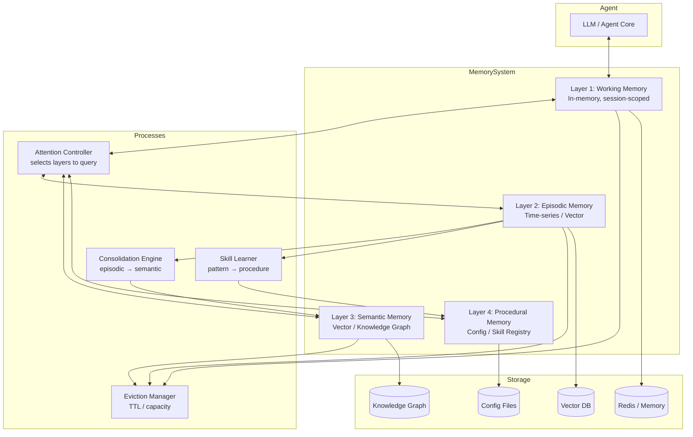

# Memory Layering Pattern

Organize AI agent memory into distinct layers—working, episodic, semantic, and procedural—each with different retention policies, access patterns, and storage backends, modeled after cognitive science principles.

## Problem

Monolithic memory systems—where every interaction, fact, and skill lives in a single store—suffer from:

- **Retrieval Interference:** Task-specific working content competes with long-term knowledge, causing the model to retrieve irrelevant information.
- **Blind Forgetting:** Without tiered retention, all memories decay at the same rate. Critical procedural knowledge may be evicted alongside trivial conversational detail.
- **No Structural Awareness:** The agent cannot distinguish "what happened just now" (episodic) from "what I know about the world" (semantic) from "how I do things" (procedural).
- **Inefficient Storage:** Factual knowledge (e.g., "the API key is in Vault") is stored multiple times across conversation logs instead of being consolidated once in semantic memory.
- **Poor Generalization:** Without a semantic consolidation pathway, the agent treats every interaction as isolated, never building persistent knowledge.

## Solution

Memory Layering implements a four-tier memory architecture inspired by cognitive science:

### Layer 1: Working Memory (High-Frequency, Volatile)
- **Contents:** Current conversation turns, immediate task context, in-progress state.
- **Capacity:** ~20–50 items or as configured by the active window.
- **Duration:** Ephemeral; persists only for the current interaction or session.
- **Backend:** In-memory buffer (Redis, or process heap).
- **Eviction:** FIFO or recency-based after session end.

### Layer 2: Episodic Memory (Medium-Frequency, Durable)
- **Contents:** Past interaction episodes—conversations, task executions, user sessions—with timestamps and outcomes.
- **Retention:** Days to weeks; bounded by time or count.
- **Backend:** Time-series DB or vector store with timestamp index.
- **Retrieval:** Temporal queries ("what happened yesterday") + similarity to current episode.

### Layer 3: Semantic Memory (Low-Frequency, Persistent)
- **Contents:** Extracted facts, user preferences, domain knowledge, consolidated learnings.
- **Retention:** Months to permanent.
- **Backend:** Vector DB or knowledge graph with fact deduplication.
- **Consolidation:** Periodic process extracts facts from episodic records and merges into semantic store.

### Layer 4: Procedural Memory (Stable, Curated)
- **Contents:** Skills, tool usage patterns, SOPs, workflow templates.
- **Retention:** Permanent unless explicitly updated.
- **Backend:** Configuration files, skill registry, or dedicated procedure store.
- **Update:** Explicit user teaching or automated observation of repeated patterns.

## Architecture



**Layer access patterns by task type:**

| Task Type | Working | Episodic | Semantic | Procedural |
|---|---|---|---|---|
| Chat continuation | High | Medium | Low | None |
| User personalization | High | Medium | High | None |
| Code generation | Low | Low | High (API knowledge) | High (tools) |
| Troubleshooting | Medium | High (past issues) | Medium | High (SOPs) |
| Learning/Teaching | Medium | Medium | High | High |

## Tradeoffs

| Aspect | Pros | Cons |
|---|---|---|
| **Multi-layer retrieval** | Rich context from multiple memory types | Slower assembly; more retrieval decisions per turn |
| **Episodic consolidation** | Reduces semantic storage churn; natural forgetting curve | Consolidation window means semantic knowledge is delayed |
| **Procedural store** | Separates skills from chat history; easy to update | Requires explicit update mechanism; cold-start with no procedures |
| **Working-only baseline** | Fastest path; zero architecture complexity | No learning; no user model; no persistent improvement |

## Example Workflow

```text
1. User returns after 3 days: "Remember that auth bug we were debugging?"
2. Episodic memory retrieves sessions from 3 days ago tagged with "auth"
3. Semantic memory returns consolidated facts from those sessions:
   - "JWT secret rotation failed because KMS key was disabled"
   - "Fix: re-enable KMS key and rotate JWT secret"
4. Procedural memory returns:
   - "Run `vault rotate jwt/secret` after KMS re-enable"
5. Working memory loads the current session context
6. Attention controller assembles: [procedural steps] + [semantic facts] + [episodic log excerpts] + [working state]
7. Agent responds with the fix steps, referencing the earlier debugging session
```

## Example Prompt

```text
You have a layered memory system with four stores:

WORKING MEMORY (current session):
{current_context}

EPISODIC MEMORY (relevant past sessions):
{retrieved_episodes}

SEMANTIC MEMORY (consolidated knowledge):
{relevant_facts}

PROCEDURAL MEMORY (skills and tools):
{relevant_procedures}

When answering:
- Use working memory for immediate context
- Reference episodic memory when the user mentions past events
- Apply semantic facts as ground truth
- Follow procedural steps when performing actions
- If information conflicts, trust procedural > semantic > episodic > working
```

## Failure Modes

| Mode | Symptom | Cause | Mitigation |
|---|---|---|---|
| **Layer Bleed** | Working memory contaminated with old episodic data | Attention controller too permissive | Tighten layer query policy; restrict episodic queries to explicit references |
| **Consolidation Lag** | Semantic facts stale while episodic has current info | Consolidation runs too infrequently | Tiered consolidation: incremental every 15 min, full nightly |
| **Semantic Hallucination** | Model states a fact that was true once but is wrong now | No fact-verification or staleness tracking | Add fact expiry dates; re-verify facts older than 30 days |
| **Procedural Blindness** | Agent fails to use available skill | Retrieval tuned for semantic/episodic, skips procedural | Add explicit procedural retrieval on tool-use intents |

## Production Considerations

- **Layer Budgeting:** Allocate token budget per layer: working 40%, episodic 20%, semantic 30%, procedural 10%. Tune based on observed utility.
- **Consolidation Safety:** Never delete episodic records until semantic consolidation is confirmed durable. Use write-ahead log for the consolidation process.
- **Retrieval Routing:** Classify user intent (chat, fact-query, tool-use, teach-me) to select the subset of layers needed for that turn.
- **Privacy & Compliance:** Episodic and semantic stores contain PII. Implement data retention limits aligned with GDPR/CCPA. Provide user-facing memory deletion API.
- **Testing:** Test each layer independently (can it store/retrieve?). Test cross-layer consistency (does consolidation produce accurate semantic facts?). Test attention controller routing against intent-labeled dataset.
