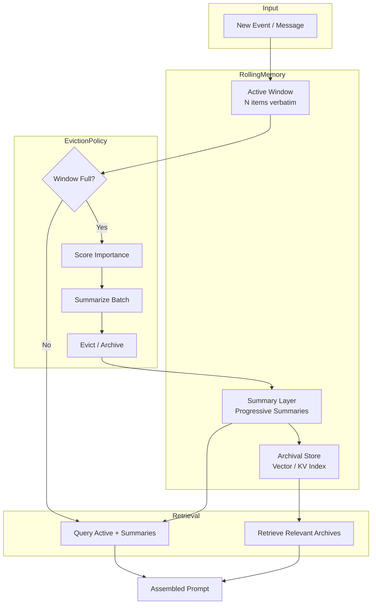

# Rolling Memory Pattern

Manage conversational and task context as a sliding window, preserving recent interactions while systematically discarding or compressing older information to fit within model context limits.

## Problem

LLMs have fixed context windows (4K–200K tokens). In extended interactions—multi-turn conversations, long-running agent tasks, or streaming data processing—the total log of events, messages, and intermediate states exceeds these limits. Naively truncating the oldest content loses critical information, while keeping everything causes token overflow, degraded model performance, or excessive cost. Without a structured memory strategy, systems suffer from:

- **Amnesia:** The model forgets early instructions, user preferences, or task context.
- **Token Waste:** Low-signal historical content dilutes attention on current relevance.
- **Cost Bloat:** Every extra token in the prompt increases latency and API cost linearly.
- **Inconsistent Behavior:** Without principled retention, behavior becomes unpredictable as context shifts.

## Solution

Rolling Memory manages context as a tiered buffer with three retention zones:

1. **Active Window** — The most recent N messages or events, kept verbatim and always visible to the model. N is tuned based on token budget (e.g., 20–40 messages for chat, 10–15 steps for agents).
2. **Summary Layer** — Older content beyond the active window is compressed into progressive summaries. Each summary covers a fixed number of prior items (e.g., 10 messages → 1 summary paragraph). Summaries can themselves be summarized in a recursive tree.
3. **Archival Store** — After configurable depth, content is evicted to an external store (vector DB, key-value store, or file) with semantic indexing for retrieval on demand.

The pattern supports three eviction policies:

- **FIFO:** Drop oldest items when the window is full. Simple but may lose important content.
- **Importance-Scored:** Each item receives a relevance score based on recency, semantic salience, or explicit user pinning. Low-score items are evicted first.
- **Summary-Then-Evict:** Before eviction, compress a batch into a summary and retain the summary in a secondary slot, preserving signal without verbatim storage.

## Architecture



**Component responsibilities:**

| Component | Responsibility |
|---|---|
| Active Window | Circular buffer holding raw items. O(1) append/evict. Configurable max length. |
| Summary Engine | Calls LLM or extractive summarizer to compress N items into 1–3 sentences. |
| Scoring Module | Assigns importance (0.0–1.0) per item using recency decay, keyword salience, or learned model. |
| Archival Adapter | Writes/reads from vector DB, Redis, or filesystem. Abstracts storage backend. |
| Context Assembler | Merges active window + summary chain + retrieved archives into one ordered prompt respecting token budget. |

## Tradeoffs

| Approach | Pros | Cons |
|---|---|---|
| **FIFO Eviction** | O(1), zero compute cost, predictable behavior | Loses important old content; no prioritization |
| **Importance Scoring** | Preserves high-signal items longer | Adds latency per insertion; scoring heuristics may misfire |
| **Summarize-Evict** | Compresses signal efficiently; tunable compression ratio | LLM summarization cost; summary drift over deep chains |
| **Archival + Retrieval** | Near-infinite retention; semantic search on demand | Retrieval latency; relevance depends on embedding quality |

## Example Workflow

```text
1. User sends message #41 in a 20-item active window (item #21 is oldest)
2. Active window detects overflow
3. Importance scorer evaluates items #21–#30
4. Items #21–#25 (lowest scores) marked for eviction
5. Summary engine condenses #21–#25 into one sentence
6. Summary appended to summary layer; raw items moved to archival store
7. Context assembler rebuilds prompt: [summaries] + [active window items #26–#41]
8. Average prompt size stays at ~70% of max tokens
```

## Example Prompt

```text
You are an AI assistant with rolling memory. Your context includes:

=== SUMMARY CHAIN (compressed from earlier conversation) ===
- User is building a NestJS API with Drizzle ORM and PostgreSQL
- They prefer repository pattern with explicit transaction handling
- Current focus: implementing user profile service with avatar upload

=== ACTIVE WINDOW (recent 20 messages) ===
User: "Now I need to handle the avatar resize before saving..."
Assistant: [describes sharp or imagemagick pipeline]
User: "What about S3 vs local storage for dev?"
... (18 more recent messages) ...

When answering, prefer recent active window context over summary chain.
If the user refers to a topic only in summaries, acknowledge you recall the gist.
```

## Failure Modes

| Mode | Symptom | Cause | Mitigation |
|---|---|---|---|
| **Summary Drift** | Model contradicts earlier information | Summaries lose detail over recursive compression | Cap summary depth at 3 levels; fall back to archival retrieval for critical facts |
| **Token Budget Miss** | Prompt exceeds model limit | Active window + summaries + retrieved archives exceed max tokens | Pre-flight token estimation; fallback truncation from lowest-priority section |
| **Stale Scoring** | Important content evicted too early | Scoring heuristic does not adapt to topic shifts | Re-score on user pin or re-query triggered importance |
| **Context Fragmentation** | Model lacks continuity across windows | Retrieved archives not semantically aligned with current query | Hybrid retrieval (keyword + vector) with reranking |
| **Cost Surprise** | API bill spikes | Over-frequent summarization or excessive archival retrieval | Rate-limit summary generation; cache retrieval results |

## Production Considerations

- **Token Budget Allocation:** Reserve 60% active window, 25% summary chain, 15% for retrieved archives. Adjust based on observed retrieval hit rate.
- **Bounded Summary Depth:** After 5 levels of recursive summarization, fully archive the oldest summaries. Deep summaries amplify drift.
- **Async Eviction:** Run eviction and summarization asynchronously after the response is sent. Never block the user-facing turn on memory bookkeeping.
- **Scoring Model Choice:** Start with recency + keyword TF-IDF (zero ML dependency). Upgrade to a small classifier (e.g., DistilBERT) only when qualitative gaps appear.
- **Observability:** Log eviction decisions, summary content, and retrieval latency to a tracing system (OpenTelemetry). Alert on >500ms retrieval p99.
- **Testing:** Unit-test eviction policies with synthetic conversation logs. Load-test with 10K+ message histories to validate O(1) active window performance.
